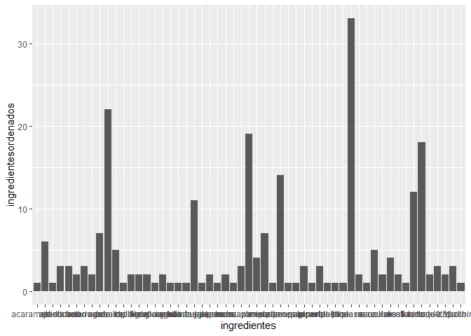
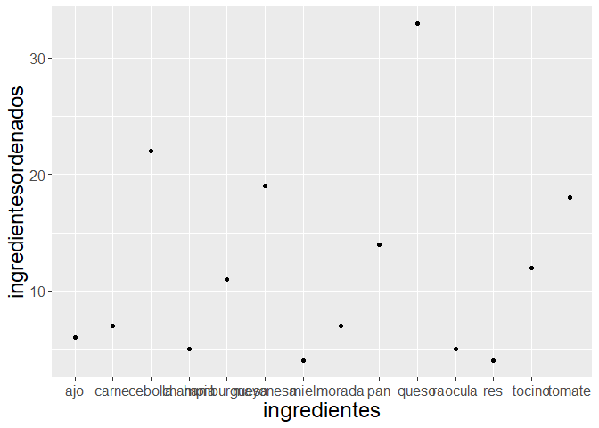
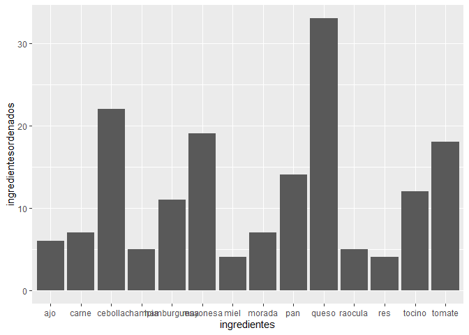

Proyecto 1 Minería de datos 2021 
================

``` r
## Informe realizado por: Eduardo Morgado y Diego Zelada 


-liberias 


library (tidyverse)
```

    ## Warning: package 'tidyverse' was built under R version 4.0.5

    ## -- Attaching packages --------------------------------------- tidyverse 1.3.0 --

    ## v ggplot2 3.3.2     v purrr   0.3.4
    ## v tibble  3.0.4     v dplyr   1.0.5
    ## v tidyr   1.1.2     v stringr 1.4.0
    ## v readr   1.4.0     v forcats 0.5.0

    ## Warning: package 'dplyr' was built under R version 4.0.5

    ## -- Conflicts ------------------------------------------ tidyverse_conflicts() --
    ## x dplyr::filter() masks stats::filter()
    ## x dplyr::lag()    masks stats::lag()

``` r
library(quanteda)
```

    ## Warning: package 'quanteda' was built under R version 4.0.5

    ## Package version: 2.1.2

    ## Parallel computing: 2 of 6 threads used.

    ## See https://quanteda.io for tutorials and examples.

    ## 
    ## Attaching package: 'quanteda'

    ## The following object is masked from 'package:utils':
    ## 
    ##     View

``` r
library(ggplot2)
library(utf8)

## para comenzar, se cargará la base de datos a utilizar de los restaurantes#


datatrabajo= read.csv(file.choose(), header = TRUE, sep = ";")

##hacemos summary para ver un resumen de los datos a utilizar##

summary(datatrabajo)
```

    ##      url               Local            Direccion            Precio         
    ##  Length:410         Length:410         Length:410         Length:410        
    ##  Class :character   Class :character   Class :character   Class :character  
    ##  Mode  :character   Mode  :character   Mode  :character   Mode  :character  
    ##                                                                             
    ##                                                                             
    ##                                                                             
    ##                                                                             
    ##  Ingredientes            nota          texto          
    ##  Length:410         Min.   :1.000   Length:410        
    ##  Class :character   1st Qu.:3.000   Class :character  
    ##  Mode  :character   Median :3.000   Mode  :character  
    ##                     Mean   :3.167                     
    ##                     3rd Qu.:4.000                     
    ##                     Max.   :5.000                     
    ##                     NA's   :8

``` r
##posterior a esto, se puede apreciar, que la variable más importante para crear una receta que asegure una buena calificación es la variable notas, dado que, según esta se puntuan las distintas hamburguesas probadas ##

##después, verificamos cuales variables pueden ser más utiles para la realización de dicho informe, por lo que se limpiará la data##

## por lo que vamos a proceder a trabajar con las variables nota, ingredientes, local. Esto debido a que creemos que segun
##el problema que se nos plantea es conveniente trabajar con estas variables ##
##dato que, nota es para la calificación como recién se dijo, ingredientes es para saber que ingredientes son los puntuados y local, para saber el mombre del local que lo produce##
datareal1 = datatrabajo[,-c(1,3,4,7)]


## posterior a esto, eliminaremos los datos nulos para trabajar con una data mas precisa y así no fallar en las inferencias posteriores##

##con la función "sapply" podemos obtener la cantidad de valores NA por columna##
##con la funcion na.omit borramos los valores NA de la base de datos ##
sapply(datareal1, function(x)sum(is.na(x)))
```

    ##        Local Ingredientes         nota 
    ##            4            4            8

``` r
datoslimpios= na.omit(datareal1)

##como podemos ver, ahora tenemos los datos limpios en la data -> datos limpios, sin valores NA en la base de datos##
## luego vamos a ordenar los datos de la nota mayor a la menor##
datosordenados= datoslimpios[order(datoslimpios$nota, decreasing = TRUE),]

## posteriormente, solo utilizaremos los datos que tengan nota 5, y no los con nota inferior, dado que, se desea obtener una buena receta o más bien una receta que asegure una buena calificación. Si vemos la Data, podemos ver que no existen notas mayores a 5 por lo que nos quedaremos solo con los 5##
notas5= filter(datosordenados, nota=="5")

##después que estan seleccionadas las variables y los datos filtrados, pasamos al análisis de los textos, es decir, de las recomendaciones que se obtuvieron después de probar los alimentos#

textoanalisis= notas5$Ingredientes

##enseguida, utilizamos la funcion char_tolower() para dejar todas las letras en minuscula y no tener problemas de como se hata escritura, es decir, unificamos o estandarizamos la escritura##

textoanalisis=char_tolower(textoanalisis)

## luego, convertimos el tipo de archivo

textoanalisis= iconv(textoanalisis, to = "ASCII//TRANSLIT")

##removemos palabras que no nos sirven y obtenemos una matriz que indica los ingredientes que tienen
## las hamburguesas que fueron calificadas  con 5 estrellas
##además removemos los iconos y terminaciones de las palabras, al igual que de como se dijo anteriormente,
##poder estandarizar la escritura o más bien las palabras ingresadas en la base de datos


palabras = dfm(textoanalisis, remove = c((stopwords("es")),("ones"), (","),("?"), ("."),("("),(")"),("!")))

## convertimos un archivo dfm (palabras) en un data frame para poder trabajar en el 
##y así hacer un contador de ingredientes


ingredientescontar= data.frame(palabras)
```

    ## Warning: 'as.data.frame.dfm' is deprecated.
    ## Use 'convert(x, to = "data.frame")' instead.
    ## See help("Deprecated")

``` r
##como podemos ver, se obtiene una matriz en donde se verifica si el texto ingresado en la base de datos  posee o no dicho ingrediente, por ejemplo, en el caso de los tomtates, se pasa la palabra tomate a una variable llamada "tomate", indicando con un 1 si está presente en el texto y con un 0 si es que no está presente, lo que se demuestra en la matriz de más abajo##


ingredientescontar
```

    ##    doc_id pato queso pepper jack jalapea cebolla morada espinaca tomate
    ## 1   text1    1     1      1    1       1       1      1        1      1
    ## 2   text2    0     1      0    0       0       0      0        0      0
    ## 3   text3    0     0      0    0       0       0      0        0      0
    ## 4   text4    0     0      0    0       0       1      0        0      0
    ## 5   text5    0     1      0    0       0       0      0        0      0
    ## 6   text6    0     1      0    0       0       0      0        0      0
    ## 7   text7    0     1      0    0       0       0      0        0      0
    ## 8   text8    0     0      0    0       0       0      0        0      0
    ## 9   text9    0     0      0    0       0       0      0        0      0
    ## 10 text10    0     0      0    0       0       0      0        0      1
    ## 11 text11    0     0      0    0       0       0      0        0      1
    ## 12 text12    0     0      0    0       0       1      1        0      1
    ## 13 text13    0     1      0    0       0       1      0        0      0
    ## 14 text14    0     0      0    0       0       0      0        0      0
    ## 15 text15    0     0      0    0       0       1      1        0      1
    ## 16 text16    0     0      0    0       0       0      0        0      1
    ## 17 text17    0     1      0    0       0       1      0        0      0
    ## 18 text18    0     2      0    0       0       1      0        1      0
    ## 19 text19    0     1      0    0       0       0      0        0      0
    ## 20 text20    0     0      0    0       0       0      0        0      1
    ## 21 text21    0     0      0    0       0       0      0        0      1
    ## 22 text22    0     1      0    0       0       0      0        0      0
    ## 23 text23    0     1      0    0       1       0      0        0      0
    ## 24 text24    0     1      0    0       0       1      0        0      1
    ## 25 text25    0     1      0    0       0       0      0        0      0
    ## 26 text26    0     0      0    0       0       0      0        0      0
    ## 27 text27    0     2      0    0       0       2      0        0      0
    ## 28 text28    0     2      0    0       0       0      0        0      0
    ## 29 text29    0     1      0    0       0       1      1        0      0
    ## 30 text30    0     0      0    0       0       0      0        0      1
    ## 31 text31    0     0      0    0       0       0      0        0      0
    ## 32 text32    0     1      0    0       0       0      0        0      0
    ## 33 text33    0     2      0    0       0       1      0        0      1
    ## 34 text34    0     1      0    0       0       0      0        0      1
    ## 35 text35    0     1      0    0       0       0      0        0      1
    ## 36 text36    0     0      0    0       0       0      0        0      0
    ## 37 text37    0     0      0    0       0       1      0        0      0
    ## 38 text38    0     0      0    0       0       0      0        0      1
    ## 39 text39    0     0      0    0       0       1      1        0      0
    ## 40 text40    0     0      0    0       0       0      0        0      0
    ## 41 text41    0     0      0    0       0       1      0        0      0
    ## 42 text42    0     0      0    0       0       0      0        0      2
    ## 43 text43    0     0      0    0       0       1      0        0      0
    ## 44 text44    0     1      0    0       0       0      0        0      0
    ## 45 text45    0     1      0    0       0       2      1        0      0
    ## 46 text46    0     0      0    0       0       1      0        0      0
    ## 47 text47    0     1      1    0       0       0      0        0      0
    ## 48 text48    0     0      0    0       0       1      1        0      0
    ## 49 text49    0     1      0    0       0       0      0        0      0
    ## 50 text50    0     1      0    0       0       1      0        0      0
    ## 51 text51    0     0      0    0       0       0      0        0      0
    ## 52 text52    0     1      1    0       0       0      0        0      0
    ## 53 text53    0     1      0    0       0       0      0        0      1
    ## 54 text54    0     1      0    0       0       0      0        0      0
    ## 55 text55    0     1      0    0       0       1      0        0      1
    ## 56 text56    0     0      0    0       0       0      0        0      0
    ##    mayonesa habanero pan brioche hamburguesa americano tocino glaseado miel
    ## 1         1        1   1       1           0         0      0        0    0
    ## 2         0        0   1       0           1         1      1        1    2
    ## 3         0        0   0       0           0         0      0        0    0
    ## 4         0        0   0       0           0         0      0        0    0
    ## 5         1        0   1       0           0         0      0        0    0
    ## 6         0        0   0       0           1         0      0        0    0
    ## 7         0        0   0       0           0         0      0        0    0
    ## 8         0        0   0       0           0         0      0        0    0
    ## 9         1        0   0       0           0         0      0        0    0
    ## 10        1        0   0       0           0         0      0        0    0
    ## 11        1        0   0       0           0         0      0        0    0
    ## 12        0        0   0       0           0         0      0        0    0
    ## 13        0        0   1       0           0         0      0        0    0
    ## 14        0        0   0       0           0         0      0        0    0
    ## 15        0        0   0       0           0         0      0        0    0
    ## 16        1        0   0       0           0         0      0        0    0
    ## 17        0        0   0       0           0         0      0        0    0
    ## 18        0        0   0       0           0         0      0        0    0
    ## 19        1        0   1       0           0         0      0        0    0
    ## 20        1        0   0       0           0         0      0        0    0
    ## 21        1        0   0       0           1         0      0        0    0
    ## 22        0        0   0       0           0         0      0        0    0
    ## 23        1        0   0       0           1         0      1        1    1
    ## 24        0        0   0       0           0         0      1        0    0
    ## 25        0        0   0       0           0         0      2        0    0
    ## 26        0        0   1       0           0         0      0        0    0
    ## 27        0        0   0       0           0         0      0        0    0
    ## 28        0        0   0       0           0         0      0        0    0
    ## 29        1        0   1       0           0         0      0        0    0
    ## 30        1        0   0       0           0         0      0        0    0
    ## 31        0        0   1       0           0         0      0        0    0
    ## 32        0        0   0       0           0         0      0        0    0
    ## 33        0        0   0       0           0         0      1        0    0
    ## 34        1        0   0       0           1         0      1        0    0
    ## 35        1        0   0       0           0         0      1        0    0
    ## 36        0        0   1       0           0         0      0        0    0
    ## 37        0        0   0       0           0         0      0        0    0
    ## 38        1        0   0       0           0         0      0        0    0
    ## 39        0        0   1       0           0         0      0        0    0
    ## 40        0        0   1       0           0         0      0        0    0
    ## 41        0        0   0       0           0         0      0        0    0
    ## 42        1        0   0       0           0         0      0        0    0
    ## 43        0        0   0       0           0         0      0        0    0
    ## 44        0        0   0       0           0         0      0        0    0
    ## 45        1        0   0       0           1         0      1        0    0
    ## 46        0        0   0       0           1         0      0        0    0
    ## 47        0        0   0       0           1         1      1        0    0
    ## 48        0        0   0       0           0         0      0        0    0
    ## 49        0        0   0       0           0         0      0        0    1
    ## 50        0        0   0       0           1         0      0        0    0
    ## 51        1        0   1       0           0         0      0        0    0
    ## 52        0        0   0       0           0         1      1        0    0
    ## 53        0        0   1       0           1         0      0        0    0
    ## 54        0        0   0       0           0         0      0        0    0
    ## 55        0        0   1       1           1         0      1        0    0
    ## 56        1        0   0       0           0         0      0        0    0
    ##    maple alioli poutine leche carne zucchini grillado toque ajo pimenta3n
    ## 1      0      0       0     0     0        0        0     0   0         0
    ## 2      2      1       1     1     0        0        0     0   0         0
    ## 3      0      0       0     0     1        1        1     1   1         1
    ## 4      0      0       0     0     0        0        0     0   0         0
    ## 5      0      0       0     0     0        0        0     0   0         0
    ## 6      0      0       0     0     1        0        0     0   1         0
    ## 7      0      0       0     0     0        0        0     0   0         0
    ## 8      0      0       0     0     0        0        0     0   0         0
    ## 9      0      0       0     0     0        0        0     0   1         0
    ## 10     0      0       0     0     0        0        0     0   0         0
    ## 11     0      0       0     0     0        0        0     0   0         0
    ## 12     0      0       0     0     0        0        0     0   0         0
    ## 13     0      0       0     0     0        0        0     0   0         0
    ## 14     0      0       0     0     0        0        0     0   0         0
    ## 15     0      0       0     0     1        0        0     0   0         0
    ## 16     0      0       0     0     0        0        0     0   0         0
    ## 17     0      0       0     0     0        0        0     0   0         0
    ## 18     0      0       0     0     0        0        0     0   0         0
    ## 19     0      0       0     0     0        0        0     0   0         0
    ## 20     0      0       0     0     0        0        0     0   1         0
    ## 21     0      0       0     0     1        0        0     0   1         0
    ## 22     0      0       0     0     0        0        0     0   0         0
    ## 23     1      0       0     0     0        0        0     0   0         0
    ## 24     0      0       0     0     0        0        0     0   0         0
    ## 25     0      0       0     0     0        0        0     0   0         0
    ## 26     0      0       0     0     0        0        0     0   0         0
    ## 27     0      0       0     0     0        0        0     0   0         0
    ## 28     0      0       0     0     0        0        0     0   0         0
    ## 29     0      0       0     0     0        0        0     0   0         0
    ## 30     0      0       0     0     0        0        0     0   0         0
    ## 31     0      0       0     0     0        0        0     0   0         0
    ## 32     0      0       0     0     0        0        0     0   0         0
    ## 33     0      0       0     0     0        0        0     0   0         0
    ## 34     0      0       0     0     1        0        0     0   0         0
    ## 35     0      0       0     0     0        0        0     0   0         0
    ## 36     0      0       0     0     0        0        0     0   0         0
    ## 37     0      0       0     0     0        0        0     0   0         0
    ## 38     0      0       0     0     1        0        0     0   0         0
    ## 39     0      0       0     0     0        0        0     0   0         1
    ## 40     0      0       0     0     0        0        0     0   1         0
    ## 41     0      0       0     0     0        0        0     0   0         0
    ## 42     0      0       0     0     0        0        0     0   0         0
    ## 43     0      0       0     0     0        0        0     0   0         0
    ## 44     0      0       0     0     0        0        0     1   0         0
    ## 45     0      0       0     0     1        0        0     0   0         0
    ## 46     0      0       0     0     0        0        0     0   0         0
    ## 47     0      0       0     0     0        0        0     0   0         0
    ## 48     0      0       0     1     0        0        0     0   0         1
    ## 49     0      0       0     0     0        0        0     0   0         0
    ## 50     0      0       0     0     0        0        0     0   0         0
    ## 51     0      0       0     0     0        0        0     0   0         0
    ## 52     0      0       0     0     0        0        0     0   0         0
    ## 53     0      0       0     0     0        0        0     0   0         0
    ## 54     0      0       0     0     0        0        0     0   0         0
    ## 55     0      0       0     0     0        0        0     0   0         0
    ## 56     0      0       0     0     0        0        0     0   0         0
    ##    acaramelado champia ricotta filete res relish betarraga raa.z picante ra
    ## 1            0       0       0      0   0      0         0     0       0  0
    ## 2            0       0       0      0   0      0         0     0       0  0
    ## 3            1       1       1      0   0      0         0     0       0  0
    ## 4            0       1       0      1   1      1         1     1       1  1
    ## 5            0       0       0      0   0      0         0     0       0  0
    ## 6            0       0       0      0   0      0         0     0       0  0
    ## 7            0       0       0      0   0      0         0     0       0  0
    ## 8            0       0       0      0   1      0         0     0       0  0
    ## 9            0       0       0      0   0      0         0     0       0  0
    ## 10           0       0       0      0   0      0         0     0       0  0
    ## 11           0       0       0      0   0      0         0     0       0  0
    ## 12           0       0       0      0   0      0         0     0       0  0
    ## 13           0       0       0      0   0      0         0     0       0  0
    ## 14           0       0       0      0   0      0         0     0       0  0
    ## 15           0       0       0      0   0      0         0     0       0  0
    ## 16           0       0       0      0   0      0         0     0       0  0
    ## 17           0       0       0      0   0      0         0     0       0  0
    ## 18           0       0       0      0   0      0         0     0       0  0
    ## 19           0       0       0      0   0      0         1     0       0  0
    ## 20           0       0       0      0   0      0         0     0       0  0
    ## 21           0       0       0      0   0      0         0     0       0  0
    ## 22           0       1       0      0   0      0         0     0       0  0
    ## 23           0       0       0      0   0      1         0     0       0  0
    ## 24           0       0       0      0   0      0         0     0       0  0
    ## 25           0       0       0      0   0      0         0     0       0  0
    ## 26           0       0       0      0   0      0         0     0       0  0
    ## 27           0       0       0      0   0      0         0     0       0  0
    ## 28           0       0       0      0   0      0         0     0       0  0
    ## 29           0       0       0      0   1      0         0     0       0  1
    ## 30           0       0       0      1   0      0         0     0       0  0
    ## 31           0       0       0      0   0      0         0     0       0  0
    ## 32           0       0       0      0   0      0         0     0       0  0
    ## 33           0       1       0      0   0      0         0     0       0  0
    ## 34           0       0       0      0   0      0         0     0       0  0
    ## 35           0       0       0      0   0      0         0     0       0  0
    ## 36           0       0       0      0   0      0         0     0       0  0
    ## 37           0       0       0      0   0      0         0     0       0  0
    ## 38           0       0       0      0   0      0         0     0       0  0
    ## 39           0       0       0      0   1      0         0     0       0  0
    ## 40           0       0       1      0   0      0         0     0       0  0
    ## 41           0       0       0      0   0      0         0     0       0  0
    ## 42           0       0       0      0   0      0         0     0       0  0
    ## 43           0       0       0      0   0      0         0     0       0  0
    ## 44           0       0       0      0   0      0         0     0       0  0
    ## 45           0       0       0      0   0      0         0     0       0  0
    ## 46           0       0       0      0   0      0         1     0       0  0
    ## 47           0       0       0      0   0      0         0     0       0  0
    ## 48           0       0       0      0   0      0         0     0       0  0
    ## 49           0       0       0      0   0      0         0     0       0  0
    ## 50           0       0       0      0   0      0         0     0       0  0
    ## 51           0       0       0      0   0      0         0     0       0  0
    ## 52           0       0       0      0   0      0         0     0       0  0
    ## 53           0       1       0      0   0      0         0     0       0  0
    ## 54           0       0       0      0   0      0         0     0       0  0
    ## 55           0       0       0      0   0      0         0     0       0  0
    ## 56           0       0       0      0   0      0         0     0       0  0
    ##    bano aros portobellos zapallo japonacs rostizado chilli raocula garbanzos
    ## 1     0    0           0       0        0         0      0       0         0
    ## 2     0    0           0       0        0         0      0       0         0
    ## 3     0    0           0       0        0         0      0       0         0
    ## 4     1    1           1       0        0         0      0       0         0
    ## 5     0    0           0       1        1         1      1       1         1
    ## 6     0    0           0       0        0         0      0       1         0
    ## 7     0    0           0       0        0         0      0       0         0
    ## 8     0    0           0       0        0         0      0       0         0
    ## 9     0    0           0       0        0         0      0       0         0
    ## 10    0    0           0       0        0         0      0       0         0
    ## 11    0    0           0       0        0         0      0       0         0
    ## 12    0    0           0       0        0         0      0       0         0
    ## 13    0    0           0       0        0         0      0       1         0
    ## 14    0    0           0       0        0         0      0       0         0
    ## 15    0    0           0       0        0         0      0       0         0
    ## 16    0    0           0       0        0         0      0       0         0
    ## 17    0    0           0       0        0         0      0       0         0
    ## 18    0    0           0       0        0         0      0       0         0
    ## 19    0    0           0       0        0         0      0       0         0
    ## 20    0    0           0       0        0         0      0       0         0
    ## 21    0    0           0       0        0         0      0       0         0
    ## 22    0    0           0       0        0         0      0       0         0
    ## 23    0    0           0       0        0         0      0       0         0
    ## 24    0    0           0       0        0         0      0       0         0
    ## 25    0    0           0       0        0         0      0       0         0
    ## 26    0    0           0       0        0         0      0       0         0
    ## 27    0    0           0       0        0         0      0       0         0
    ## 28    0    0           0       0        0         0      0       0         0
    ## 29    1    0           0       0        0         0      0       1         0
    ## 30    0    0           0       0        0         0      0       0         0
    ## 31    0    0           0       0        0         0      0       0         0
    ## 32    0    0           0       0        0         0      0       0         0
    ## 33    0    1           0       0        0         0      0       0         0
    ## 34    0    0           0       0        0         0      0       0         0
    ## 35    0    0           0       0        0         0      0       0         0
    ## 36    0    0           0       0        0         0      0       0         0
    ## 37    0    0           0       0        0         0      0       0         0
    ## 38    0    0           0       0        0         0      0       0         0
    ## 39    0    0           0       0        0         0      0       0         0
    ## 40    0    0           0       0        0         0      0       0         0
    ## 41    0    0           0       0        0         0      0       0         0
    ## 42    0    0           0       0        0         0      0       0         0
    ## 43    0    0           0       0        0         0      0       0         0
    ## 44    0    0           0       0        0         0      0       0         0
    ## 45    0    1           0       0        0         0      0       0         0
    ## 46    0    0           0       0        0         0      0       0         0
    ## 47    0    0           0       0        0         0      0       0         0
    ## 48    0    0           0       1        0         0      0       0         0
    ## 49    0    0           0       0        0         0      0       0         0
    ## 50    0    0           0       0        0         0      0       0         0
    ## 51    0    0           0       0        0         0      0       0         0
    ## 52    0    0           0       0        0         0      0       0         0
    ## 53    0    0           0       0        0         0      0       0         0
    ## 54    0    0           0       0        0         0      0       0         0
    ## 55    0    0           0       0        0         0      0       0         0
    ## 56    0    0           0       1        0         0      0       1         0
    ##    grana padano focaccia X50 X. prieta parmesano manzana verde caramelizada
    ## 1      0      0        0   0  0      0         0       0     0            0
    ## 2      0      0        0   0  0      0         0       0     0            0
    ## 3      0      0        0   0  0      0         0       0     0            0
    ## 4      0      0        0   0  0      0         0       0     0            0
    ## 5      1      1        1   0  0      0         0       0     0            0
    ## 6      0      0        0   2  2      1         1       1     1            1
    ## 7      0      0        0   0  0      0         0       0     1            0
    ## 8      0      0        0   0  0      0         0       0     0            0
    ## 9      0      0        0   0  0      0         0       0     0            0
    ## 10     0      0        0   0  0      0         0       0     0            0
    ## 11     0      0        0   0  0      0         0       0     0            0
    ## 12     0      0        0   0  0      0         0       0     0            0
    ## 13     0      0        0   0  0      0         0       0     0            0
    ## 14     0      0        0   0  0      0         0       0     0            0
    ## 15     0      0        0   0  0      0         0       0     1            0
    ## 16     0      0        0   0  0      0         0       0     0            0
    ## 17     0      0        0   0  0      0         0       0     0            1
    ## 18     0      0        0   0  0      0         0       0     0            1
    ## 19     0      0        0   0  0      0         0       0     0            0
    ## 20     0      0        0   0  0      0         0       0     0            0
    ## 21     0      0        0   0  0      0         0       0     0            0
    ## 22     0      0        0   0  0      0         0       0     0            0
    ## 23     0      0        0   0  0      0         0       0     0            0
    ## 24     0      0        0   0  0      0         0       0     0            0
    ## 25     0      0        0   0  0      0         0       0     0            0
    ## 26     0      0        0   0  0      0         0       0     0            0
    ## 27     0      0        0   0  0      0         0       0     0            1
    ## 28     0      0        0   0  0      0         0       0     0            0
    ## 29     0      0        0   0  0      0         0       0     0            0
    ## 30     0      0        0   0  0      0         0       0     1            0
    ## 31     0      0        0   0  0      0         0       0     0            0
    ## 32     0      0        0   0  0      0         0       0     0            0
    ## 33     0      0        0   0  0      0         0       0     0            0
    ## 34     0      0        0   0  0      0         0       0     0            0
    ## 35     0      0        0   0  0      0         0       0     0            0
    ## 36     0      0        0   0  1      0         0       0     0            0
    ## 37     0      0        0   0  0      0         0       0     0            0
    ## 38     0      0        0   0  0      0         0       0     0            0
    ## 39     0      0        0   0  0      0         0       0     0            0
    ## 40     0      0        1   0  0      0         0       0     0            0
    ## 41     0      0        0   0  0      0         0       0     0            1
    ## 42     0      0        0   0  0      0         0       0     0            0
    ## 43     0      0        0   0  0      0         0       0     0            0
    ## 44     0      0        0   0  0      0         0       0     0            0
    ## 45     0      0        0   0  0      0         0       0     0            0
    ## 46     0      0        0   0  0      0         0       0     0            1
    ## 47     0      0        0   0  0      0         0       0     0            0
    ## 48     0      0        0   0  0      0         0       0     0            0
    ## 49     0      0        0   0  0      0         0       0     0            0
    ## 50     0      0        0   0  0      0         0       0     0            0
    ## 51     0      0        0   0  0      0         0       0     0            0
    ## 52     0      0        0   0  0      0         0       0     0            0
    ## 53     0      0        0   0  0      0         0       0     1            0
    ## 54     0      0        0   0  0      0         0       0     0            0
    ## 55     0      0        0   0  0      0         0       0     0            0
    ## 56     0      0        0   0  0      0         0       0     0            0
    ##    palta salsa salma3n mantequilla aromatizada tomates asados crema saborizado
    ## 1      0     0       0           0           0       0      0     0          0
    ## 2      0     0       0           0           0       0      0     0          0
    ## 3      0     0       0           0           0       0      0     0          0
    ## 4      0     0       0           0           0       0      0     0          0
    ## 5      0     0       0           0           0       0      0     0          0
    ## 6      1     1       0           0           0       0      0     0          0
    ## 7      0     0       1           1           1       1      1     1          1
    ## 8      0     0       0           0           0       0      0     1          0
    ## 9      0     0       0           0           0       0      0     0          0
    ## 10     1     0       0           0           0       0      0     0          0
    ## 11     1     0       0           0           0       0      0     0          0
    ## 12     0     1       0           0           0       0      0     0          0
    ## 13     0     0       0           0           0       0      0     0          0
    ## 14     0     0       0           0           0       0      0     0          0
    ## 15     0     0       0           0           0       0      0     0          0
    ## 16     0     0       0           0           0       0      0     0          0
    ## 17     1     0       0           0           0       0      0     0          0
    ## 18     0     2       0           0           0       0      0     0          0
    ## 19     0     1       0           0           0       0      0     0          0
    ## 20     0     1       0           0           0       0      0     0          0
    ## 21     0     0       0           0           0       0      0     0          0
    ## 22     0     1       0           0           0       0      0     1          0
    ## 23     0     0       0           0           0       0      0     0          0
    ## 24     0     0       0           0           0       0      0     0          0
    ## 25     0     1       0           0           0       0      0     0          0
    ## 26     0     0       0           0           0       1      0     0          0
    ## 27     0     0       0           0           0       0      0     0          0
    ## 28     0     0       0           1           0       0      0     1          0
    ## 29     0     1       0           0           0       0      0     0          0
    ## 30     0     0       0           0           0       0      0     0          0
    ## 31     0     0       0           0           0       0      0     0          0
    ## 32     1     1       0           0           0       0      0     0          0
    ## 33     0     1       0           0           0       0      0     0          0
    ## 34     0     0       0           0           0       0      0     0          0
    ## 35     0     0       0           0           0       0      0     0          0
    ## 36     1     1       0           0           0       0      0     0          0
    ## 37     0     0       0           0           0       0      0     0          0
    ## 38     1     0       0           0           0       0      0     0          0
    ## 39     0     0       0           0           0       0      0     0          0
    ## 40     0     0       0           0           0       1      1     0          0
    ## 41     0     0       0           0           0       0      0     0          0
    ## 42     1     1       0           0           0       0      0     0          0
    ## 43     0     0       0           0           0       0      0     0          0
    ## 44     0     1       0           0           0       1      0     0          0
    ## 45     0     0       0           0           0       0      0     0          0
    ## 46     0     1       0           0           0       0      0     0          0
    ## 47     0     1       0           0           0       0      0     0          0
    ## 48     0     0       0           0           0       0      0     0          0
    ## 49     1     0       0           0           0       0      0     1          0
    ## 50     0     0       0           0           0       0      0     1          0
    ## 51     0     0       0           0           0       0      0     0          0
    ## 52     0     1       0           0           0       0      0     0          0
    ## 53     0     0       0           0           0       0      0     0          0
    ## 54     0     0       0           0           0       0      1     0          0
    ## 55     0     0       0           0           0       0      0     0          0
    ## 56     0     0       0           0           0       0      0     0          0
    ##    coraza3n alcachofa mix crudo machacado cida ciboullette alcaparras
    ## 1         0         0   0     0         0    0           0          0
    ## 2         0         0   0     0         0    0           0          0
    ## 3         0         0   0     0         0    0           0          0
    ## 4         0         0   0     0         0    0           0          0
    ## 5         0         0   0     0         0    0           0          0
    ## 6         0         0   0     0         0    0           0          0
    ## 7         1         1   1     0         0    0           0          0
    ## 8         0         0   0     1         1    1           1          1
    ## 9         0         0   0     0         0    0           0          0
    ## 10        0         0   0     0         0    0           0          0
    ## 11        0         0   0     0         0    0           0          0
    ## 12        0         0   0     0         0    0           0          0
    ## 13        0         0   0     0         0    0           0          0
    ## 14        0         0   0     0         0    0           0          0
    ## 15        0         0   0     0         0    0           0          0
    ## 16        0         0   0     0         0    0           0          0
    ## 17        0         0   0     0         0    0           0          0
    ## 18        0         0   0     0         0    0           0          0
    ## 19        0         0   0     0         0    0           0          0
    ## 20        0         0   0     0         0    0           0          0
    ## 21        0         0   0     0         0    0           0          0
    ## 22        0         0   1     0         0    0           0          0
    ## 23        0         0   0     0         0    0           0          0
    ## 24        0         0   0     0         0    0           0          0
    ## 25        0         0   1     0         0    0           0          0
    ## 26        0         0   0     0         0    0           0          0
    ## 27        0         0   0     0         0    0           0          0
    ## 28        0         0   0     0         0    0           0          0
    ## 29        0         0   0     0         0    0           0          0
    ## 30        0         0   0     0         0    0           0          0
    ## 31        0         0   0     0         0    0           0          0
    ## 32        0         0   0     0         0    0           0          0
    ## 33        0         0   0     0         0    0           0          0
    ## 34        0         0   0     0         0    0           0          0
    ## 35        0         0   0     0         0    0           0          0
    ## 36        0         0   0     0         0    0           0          0
    ## 37        0         0   0     0         0    0           0          0
    ## 38        0         0   0     0         0    0           0          0
    ## 39        0         0   0     0         0    0           0          0
    ## 40        0         0   0     0         0    0           0          0
    ## 41        0         0   0     0         0    0           0          0
    ## 42        0         0   0     0         0    0           0          0
    ## 43        0         0   0     0         0    0           0          0
    ## 44        0         0   0     0         0    0           0          0
    ## 45        0         0   0     0         0    0           0          0
    ## 46        0         0   0     0         0    0           0          0
    ## 47        0         0   0     0         0    0           0          0
    ## 48        0         0   0     0         0    0           0          0
    ## 49        0         0   0     0         0    0           0          0
    ## 50        0         0   0     0         0    0           0          0
    ## 51        0         0   0     0         0    0           0          0
    ## 52        0         0   0     0         0    0           0          0
    ## 53        0         0   1     0         0    0           0          0
    ## 54        0         0   0     0         0    0           0          0
    ## 55        0         0   0     0         0    0           0          0
    ## 56        0         0   0     0         0    0           0          0
    ##    pepinillos vinagre chucrut repollo morado lechuga sopaipillas sierra ahumada
    ## 1           0       0       0       0      0       0           0      0       0
    ## 2           0       0       0       0      0       0           0      0       0
    ## 3           0       0       0       0      0       0           0      0       0
    ## 4           0       0       0       0      0       0           0      0       0
    ## 5           0       0       0       0      0       0           0      0       0
    ## 6           0       0       0       0      0       0           0      0       0
    ## 7           0       0       0       0      0       0           0      0       0
    ## 8           1       1       1       1      1       1           1      0       0
    ## 9           0       0       0       0      0       1           0      1       1
    ## 10          0       0       0       0      0       0           1      0       0
    ## 11          0       0       0       0      0       0           0      0       0
    ## 12          0       0       0       0      0       1           0      0       0
    ## 13          0       0       0       0      0       0           0      0       0
    ## 14          0       0       0       0      0       0           0      0       0
    ## 15          0       0       0       0      0       0           0      0       0
    ## 16          0       0       0       0      0       0           0      0       0
    ## 17          0       0       0       0      0       0           0      0       0
    ## 18          1       0       0       0      0       0           0      0       0
    ## 19          0       0       0       0      0       0           0      0       0
    ## 20          0       0       1       0      0       0           0      0       0
    ## 21          0       0       1       0      0       0           0      0       0
    ## 22          0       0       0       0      0       0           0      0       0
    ## 23          0       0       0       0      0       0           0      0       0
    ## 24          1       0       0       0      0       1           0      0       0
    ## 25          0       0       0       0      0       0           0      0       0
    ## 26          0       0       0       0      0       0           0      0       0
    ## 27          0       0       0       0      0       0           0      0       0
    ## 28          0       0       0       0      0       0           0      0       0
    ## 29          0       0       0       0      0       0           0      0       0
    ## 30          0       0       0       0      0       0           0      0       0
    ## 31          0       0       0       0      0       0           0      0       0
    ## 32          0       0       0       0      0       0           0      0       0
    ## 33          0       0       0       0      0       1           0      0       0
    ## 34          0       0       0       0      0       1           0      0       0
    ## 35          0       0       0       0      0       1           0      0       0
    ## 36          0       0       0       0      0       0           0      0       0
    ## 37          0       0       0       0      0       0           0      0       0
    ## 38          0       0       0       0      0       0           0      0       0
    ## 39          0       0       0       0      0       0           0      0       0
    ## 40          0       0       0       0      0       0           0      0       0
    ## 41          0       0       0       0      0       0           0      0       0
    ## 42          0       0       0       0      0       0           0      0       0
    ## 43          0       0       0       0      0       0           0      0       0
    ## 44          0       0       0       0      0       0           0      0       0
    ## 45          0       0       0       0      0       0           0      0       0
    ## 46          0       0       0       0      0       1           0      0       0
    ## 47          0       0       0       0      0       0           0      0       0
    ## 48          0       0       0       0      0       1           0      0       0
    ## 49          0       0       0       0      0       1           0      0       0
    ## 50          1       0       0       0      0       1           0      0       1
    ## 51          0       0       0       0      0       0           0      0       0
    ## 52          0       0       0       0      0       0           0      0       0
    ## 53          0       0       0       0      0       0           0      0       0
    ## 54          0       0       0       0      0       0           0      0       0
    ## 55          1       0       0       0      0       1           0      0       0
    ## 56          0       0       0       0      0       0           0      0       0
    ##    desmenuzada perejil lima3n cama costina pebre cochayuyo sopaipilla mechada
    ## 1            0       0      0    0       0     0         0          0       0
    ## 2            0       0      0    0       0     0         0          0       0
    ## 3            0       0      0    0       0     0         0          0       0
    ## 4            0       0      0    0       0     0         0          0       0
    ## 5            0       0      0    0       0     0         0          0       0
    ## 6            0       0      0    0       0     0         0          0       0
    ## 7            0       0      0    0       0     0         0          0       0
    ## 8            0       0      0    0       0     0         0          0       0
    ## 9            1       1      1    1       1     1         1          1       0
    ## 10           0       0      0    0       0     0         0          0       1
    ## 11           0       0      0    0       0     0         0          0       0
    ## 12           0       0      0    0       0     0         0          0       0
    ## 13           0       0      0    0       0     0         0          0       0
    ## 14           0       0      0    0       0     0         0          0       0
    ## 15           0       0      0    0       0     0         0          0       1
    ## 16           0       0      0    0       0     0         0          0       0
    ## 17           0       0      0    0       0     0         0          0       0
    ## 18           0       0      0    0       0     0         0          0       0
    ## 19           0       0      0    0       0     0         0          0       0
    ## 20           0       0      0    0       0     0         0          0       0
    ## 21           0       0      0    0       0     0         0          0       0
    ## 22           0       0      0    0       0     0         0          0       0
    ## 23           0       0      0    0       0     0         0          0       0
    ## 24           0       0      0    0       0     0         0          0       0
    ## 25           0       0      0    0       0     0         0          0       0
    ## 26           0       0      0    0       0     0         0          0       0
    ## 27           1       0      0    0       0     0         0          0       0
    ## 28           0       0      0    0       0     0         0          0       0
    ## 29           0       0      0    0       0     0         0          0       0
    ## 30           0       0      0    0       0     0         0          0       0
    ## 31           0       0      0    0       0     0         0          0       0
    ## 32           0       0      0    0       0     0         0          0       0
    ## 33           0       0      0    0       0     0         0          0       0
    ## 34           0       0      0    0       0     0         0          0       0
    ## 35           0       0      0    0       0     0         0          0       0
    ## 36           0       0      0    0       0     0         0          0       0
    ## 37           0       0      0    0       0     0         0          0       0
    ## 38           0       0      0    0       0     0         0          0       1
    ## 39           0       0      0    0       0     0         0          0       0
    ## 40           0       0      0    0       0     0         0          0       0
    ## 41           0       0      0    0       0     0         0          0       0
    ## 42           0       0      0    0       0     0         0          0       1
    ## 43           0       0      0    0       0     1         0          0       0
    ## 44           0       0      0    0       0     0         0          0       0
    ## 45           0       0      0    0       0     0         0          0       0
    ## 46           0       0      0    0       0     0         0          0       0
    ## 47           0       0      0    0       0     0         0          0       0
    ## 48           0       0      0    0       0     0         0          0       0
    ## 49           0       0      0    0       0     0         0          0       0
    ## 50           0       0      0    0       0     0         0          0       0
    ## 51           0       0      0    0       0     0         0          0       0
    ## 52           0       0      0    0       0     0         0          0       0
    ## 53           0       0      0    0       0     0         0          0       0
    ## 54           0       0      0    0       0     0         0          0       0
    ## 55           0       0      0    0       0     0         0          0       0
    ## 56           0       0      0    0       0     0         0          0       0
    ##    casera lomo cerdo reineta frita blanca aja.es blanqueados cilantro longaniza
    ## 1       0    0     0       0     0      0      0           0        0         0
    ## 2       0    0     0       0     0      0      0           0        0         0
    ## 3       0    0     0       0     0      0      0           0        0         0
    ## 4       0    0     0       0     0      0      0           0        0         0
    ## 5       0    0     0       0     0      0      0           0        0         0
    ## 6       0    0     0       0     0      0      0           0        0         0
    ## 7       0    0     0       0     0      0      0           0        0         0
    ## 8       0    0     0       0     0      0      0           0        0         0
    ## 9       0    0     0       0     0      0      0           0        0         0
    ## 10      1    0     0       0     0      0      0           0        0         0
    ## 11      1    1     1       0     0      0      0           0        0         0
    ## 12      0    0     0       1     1      1      1           1        1         0
    ## 13      0    0     0       0     0      0      0           0        0         1
    ## 14      0    0     0       0     0      0      0           0        0         0
    ## 15      0    0     0       0     0      0      0           0        0         0
    ## 16      1    0     0       0     0      0      0           0        0         0
    ## 17      0    0     0       0     1      0      0           0        0         0
    ## 18      0    0     0       0     0      0      0           0        0         0
    ## 19      0    0     0       0     1      0      0           0        1         0
    ## 20      0    0     0       0     0      0      0           0        0         0
    ## 21      1    0     1       0     0      0      0           0        0         0
    ## 22      0    0     0       0     0      0      0           0        1         0
    ## 23      0    0     0       0     0      0      0           0        0         0
    ## 24      0    0     0       0     0      0      0           0        0         0
    ## 25      0    0     0       0     0      0      0           0        0         0
    ## 26      0    0     1       0     0      0      0           0        0         0
    ## 27      0    0     0       0     0      0      0           0        0         0
    ## 28      0    0     0       0     0      0      0           0        0         0
    ## 29      0    0     0       0     0      0      0           0        0         0
    ## 30      0    0     0       0     0      0      0           0        0         0
    ## 31      0    0     0       0     0      0      0           0        0         0
    ## 32      0    0     0       0     0      0      0           0        0         0
    ## 33      0    0     0       0     0      0      0           0        0         0
    ## 34      0    0     0       0     0      0      1           0        0         0
    ## 35      0    0     0       0     0      0      1           0        0         0
    ## 36      1    0     1       0     0      0      0           0        0         0
    ## 37      0    0     0       0     0      0      0           0        0         0
    ## 38      0    0     0       0     0      0      0           0        0         0
    ## 39      0    1     0       0     0      0      0           0        0         0
    ## 40      0    0     0       0     0      0      0           0        0         0
    ## 41      0    0     0       0     0      0      0           0        0         0
    ## 42      0    0     0       0     0      0      0           0        0         0
    ## 43      0    0     0       0     0      0      0           0        0         0
    ## 44      1    0     0       0     1      0      0           0        0         0
    ## 45      0    0     0       0     0      0      0           0        0         0
    ## 46      0    0     0       0     0      0      0           0        1         0
    ## 47      0    0     0       0     0      0      0           0        0         0
    ## 48      0    0     0       0     0      0      0           0        0         0
    ## 49      0    0     0       0     0      0      0           0        0         0
    ## 50      0    0     0       0     0      0      0           0        0         0
    ## 51      0    0     0       0     0      0      0           0        0         0
    ## 52      0    0     0       0     0      0      0           0        0         0
    ## 53      0    0     0       0     0      0      0           0        0         0
    ## 54      0    0     0       0     0      0      0           0        0         0
    ## 55      0    0     0       0     0      0      0           0        0         0
    ## 56      0    0     0       0     0      0      0           0        0         0
    ##    jabala. aja. amarillo zanahoria alba3ndigas quinoa crocante hojas verdes
    ## 1        0    0        0         0           0      0        0     0      0
    ## 2        0    0        0         0           0      0        0     0      0
    ## 3        0    0        0         0           0      0        0     0      0
    ## 4        0    0        0         0           0      0        0     0      0
    ## 5        0    0        0         0           0      0        0     0      0
    ## 6        0    0        0         0           0      0        0     0      0
    ## 7        0    0        0         0           0      0        0     0      0
    ## 8        0    0        0         0           0      0        0     0      0
    ## 9        0    0        0         0           0      0        0     0      0
    ## 10       0    0        0         0           0      0        0     0      0
    ## 11       0    0        0         0           0      0        0     0      0
    ## 12       0    0        0         0           0      0        0     0      0
    ## 13       1    1        1         1           0      0        0     0      0
    ## 14       0    0        0         0           1      1        1     1      1
    ## 15       0    1        0         0           0      0        0     0      0
    ## 16       0    0        0         0           0      0        0     0      1
    ## 17       0    0        0         0           0      0        0     0      0
    ## 18       0    0        0         0           0      0        0     0      0
    ## 19       0    0        0         0           0      0        0     0      0
    ## 20       0    1        0         0           0      0        0     0      0
    ## 21       0    1        0         0           0      0        0     0      0
    ## 22       0    0        0         0           0      0        0     0      0
    ## 23       0    0        0         0           0      0        0     0      0
    ## 24       0    0        0         0           0      0        0     0      0
    ## 25       0    0        0         0           0      0        0     0      0
    ## 26       0    0        0         0           0      0        0     0      0
    ## 27       0    0        0         0           0      0        0     0      0
    ## 28       0    0        0         0           0      0        0     0      1
    ## 29       0    0        0         0           0      0        0     0      0
    ## 30       0    1        0         0           0      0        0     0      1
    ## 31       0    0        0         0           0      0        0     0      0
    ## 32       0    0        0         0           0      0        0     0      0
    ## 33       0    0        0         0           0      0        1     0      0
    ## 34       0    0        0         0           0      0        1     0      1
    ## 35       0    0        0         0           0      0        0     0      1
    ## 36       0    0        0         0           0      0        0     0      0
    ## 37       0    0        0         0           0      0        0     0      0
    ## 38       0    0        0         0           0      0        0     0      0
    ## 39       0    0        0         0           0      0        0     0      0
    ## 40       0    0        0         0           0      0        0     0      0
    ## 41       0    0        0         0           0      0        0     0      0
    ## 42       0    0        0         0           0      0        0     0      0
    ## 43       0    0        0         0           0      0        0     0      0
    ## 44       0    0        0         0           0      0        0     0      0
    ## 45       0    0        0         0           0      0        1     0      0
    ## 46       0    0        0         1           0      0        0     0      0
    ## 47       0    1        0         0           0      0        0     0      0
    ## 48       0    0        0         1           0      0        0     0      0
    ## 49       0    0        0         0           0      0        0     0      0
    ## 50       0    0        0         0           0      0        0     0      0
    ## 51       0    0        0         0           0      0        0     0      0
    ## 52       0    1        0         0           0      0        0     0      0
    ## 53       0    0        0         1           0      0        0     0      0
    ## 54       0    0        0         0           0      0        0     0      0
    ## 55       0    0        0         0           0      0        0     0      0
    ## 56       0    0        0         0           0      0        0     0      0
    ##    huevo frito brotes alfalfa chips camote fresco agregado chancho piedra
    ## 1      0     0      0       0     0      0      0        0       0      0
    ## 2      0     0      0       0     0      0      0        0       0      0
    ## 3      0     0      0       0     0      0      0        0       0      0
    ## 4      0     0      0       0     0      0      0        0       0      0
    ## 5      0     0      0       0     0      0      0        0       0      0
    ## 6      0     0      0       0     0      0      0        0       0      0
    ## 7      0     0      0       0     0      0      0        0       0      0
    ## 8      0     0      0       0     0      0      0        0       0      0
    ## 9      0     0      0       0     0      0      0        0       0      0
    ## 10     0     0      0       0     0      0      0        0       0      0
    ## 11     0     0      0       0     0      0      0        0       0      0
    ## 12     0     0      0       0     0      0      0        0       0      0
    ## 13     0     0      0       0     0      0      0        0       0      0
    ## 14     1     1      1       1     1      1      0        0       0      0
    ## 15     0     0      0       0     0      0      1        1       1      1
    ## 16     0     0      0       0     0      0      0        0       0      0
    ## 17     1     1      0       0     0      0      0        0       0      0
    ## 18     0     0      0       0     0      0      0        0       0      0
    ## 19     0     0      0       0     1      0      0        0       0      0
    ## 20     0     0      0       0     0      0      0        0       0      0
    ## 21     0     0      0       0     0      0      0        0       0      0
    ## 22     0     0      0       0     0      0      0        0       0      0
    ## 23     0     0      0       0     0      0      0        0       0      0
    ## 24     0     0      0       0     0      0      0        0       0      0
    ## 25     0     0      0       0     0      0      0        0       0      0
    ## 26     0     0      0       0     0      0      0        0       0      0
    ## 27     0     0      0       0     0      0      0        0       0      0
    ## 28     0     0      0       0     0      0      0        0       0      0
    ## 29     0     0      0       0     0      0      0        0       0      0
    ## 30     0     0      0       0     0      0      0        1       0      0
    ## 31     0     0      0       0     0      0      0        0       0      0
    ## 32     0     0      0       0     0      0      0        0       0      0
    ## 33     0     0      0       0     0      0      0        0       0      0
    ## 34     0     0      0       0     0      0      0        0       0      0
    ## 35     0     0      0       0     0      0      0        0       0      0
    ## 36     0     0      0       0     0      0      0        0       0      0
    ## 37     1     1      0       0     0      0      0        0       0      0
    ## 38     0     0      0       0     0      0      0        0       0      0
    ## 39     0     0      0       0     0      0      0        0       0      0
    ## 40     0     0      0       0     0      0      0        0       0      0
    ## 41     1     1      0       0     0      0      0        0       0      0
    ## 42     0     0      0       0     0      0      0        0       0      0
    ## 43     0     0      0       0     0      0      0        0       0      0
    ## 44     0     0      0       0     0      0      0        0       0      0
    ## 45     0     0      0       0     0      0      0        0       0      0
    ## 46     0     0      0       0     0      0      0        0       0      0
    ## 47     0     0      0       0     0      0      0        0       0      0
    ## 48     0     0      0       0     0      0      0        0       0      0
    ## 49     0     0      0       0     0      0      0        0       0      0
    ## 50     0     0      0       0     0      0      0        0       0      0
    ## 51     0     1      0       0     0      0      0        0       0      0
    ## 52     0     0      0       0     0      0      0        0       0      0
    ## 53     0     0      0       0     0      0      0        0       0      0
    ## 54     0     0      0       0     0      0      0        0       0      0
    ## 55     0     0      0       0     0      0      0        0       0      0
    ## 56     0     0      0       0     0      0      0        0       0      0
    ##    merkacn marraqueta X1 X..1 X2 lengua porotos mantecoso derretido kiss my
    ## 1        0          0  0    0  0      0       0         0         0    0  0
    ## 2        0          0  0    0  0      0       0         0         0    0  0
    ## 3        0          0  0    0  0      0       0         0         0    0  0
    ## 4        0          0  0    0  0      0       0         0         0    0  0
    ## 5        0          0  0    0  0      0       0         0         0    0  0
    ## 6        0          0  0    0  0      0       0         0         0    0  0
    ## 7        0          0  0    0  0      0       0         0         0    0  0
    ## 8        0          0  0    0  0      0       0         0         0    0  0
    ## 9        0          0  0    0  0      0       0         0         0    0  0
    ## 10       0          0  0    0  0      0       0         0         0    0  0
    ## 11       0          0  0    0  0      0       0         0         0    0  0
    ## 12       0          0  0    0  0      0       0         0         0    0  0
    ## 13       0          0  0    0  0      0       0         0         0    0  0
    ## 14       0          0  0    0  0      0       0         0         0    0  0
    ## 15       1          1  1    1  1      0       0         0         0    0  0
    ## 16       0          0  0    0  0      1       1         0         0    0  0
    ## 17       0          0  0    0  0      0       0         1         1    1  1
    ## 18       0          0  0    0  0      0       0         1         0    0  0
    ## 19       0          0  0    0  0      0       0         0         0    0  0
    ## 20       0          0  0    0  0      0       0         0         0    0  0
    ## 21       0          0  0    0  0      0       0         0         0    0  0
    ## 22       0          0  0    0  0      0       0         0         1    0  0
    ## 23       0          0  0    0  0      0       0         0         0    0  0
    ## 24       0          0  0    0  0      0       0         0         0    0  0
    ## 25       0          0  0    0  0      0       0         0         0    0  0
    ## 26       1          0  0    0  0      0       0         0         0    0  0
    ## 27       0          0  0    0  0      0       0         0         0    0  0
    ## 28       1          0  0    0  0      0       0         0         0    0  0
    ## 29       0          0  0    0  0      0       0         0         0    0  0
    ## 30       0          0  0    0  0      0       1         0         0    0  0
    ## 31       0          0  0    0  0      0       0         0         0    0  0
    ## 32       0          0  0    0  0      0       0         0         0    0  0
    ## 33       0          0  0    0  0      0       0         0         0    0  0
    ## 34       0          0  0    0  0      0       0         0         0    0  0
    ## 35       0          0  0    0  0      0       0         0         0    0  0
    ## 36       0          0  0    0  0      0       0         0         0    0  0
    ## 37       0          0  0    0  0      0       0         0         0    0  0
    ## 38       0          1  0    0  0      0       0         0         0    0  0
    ## 39       0          0  0    0  0      0       0         0         0    0  0
    ## 40       0          0  0    0  0      0       0         0         0    0  0
    ## 41       0          1  0    0  0      0       0         0         0    0  0
    ## 42       0          0  0    0  0      0       0         0         0    0  0
    ## 43       0          0  0    0  0      0       0         0         0    0  0
    ## 44       0          0  0    0  0      0       0         0         0    0  0
    ## 45       0          0  0    0  0      0       0         0         0    0  0
    ## 46       0          0  0    0  0      0       1         0         0    0  0
    ## 47       0          0  0    0  0      0       0         0         0    0  0
    ## 48       0          0  0    0  0      0       0         0         0    0  0
    ## 49       0          0  0    0  0      0       0         0         0    0  0
    ## 50       0          0  0    0  0      0       0         0         0    0  0
    ## 51       0          0  0    0  0      0       0         0         0    0  0
    ## 52       0          0  0    0  0      0       0         0         0    0  0
    ## 53       0          0  0    0  0      0       0         0         0    0  0
    ## 54       0          0  0    0  0      0       0         0         0    0  0
    ## 55       0          0  0    0  0      0       0         0         0    0  0
    ## 56       0          0  0    0  0      0       0         0         0    0  0
    ##    hass azul casa pulled chicken ahumado cabra teriyaki berros francacs casero
    ## 1     0    0    0      0       0       0     0        0      0        0      0
    ## 2     0    0    0      0       0       0     0        0      0        0      0
    ## 3     0    0    0      0       0       0     0        0      0        0      0
    ## 4     0    0    0      0       0       0     0        0      0        0      0
    ## 5     0    0    0      0       0       0     0        0      0        0      0
    ## 6     0    0    0      0       0       0     0        0      0        0      0
    ## 7     0    0    0      0       0       0     0        0      0        0      0
    ## 8     0    0    0      0       0       0     0        0      0        0      0
    ## 9     0    0    0      0       0       0     0        0      0        0      0
    ## 10    0    0    0      0       0       0     0        0      0        0      0
    ## 11    0    0    0      0       0       0     0        0      0        0      0
    ## 12    0    0    0      0       0       0     0        0      0        0      0
    ## 13    0    0    0      0       0       0     0        0      0        0      0
    ## 14    0    0    0      0       0       0     0        0      0        0      0
    ## 15    0    0    0      0       0       0     0        0      0        0      0
    ## 16    0    0    0      0       0       0     0        0      0        0      0
    ## 17    1    0    0      0       0       0     0        0      0        0      0
    ## 18    0    1    1      0       0       0     0        0      0        0      0
    ## 19    0    0    0      1       1       1     1        1      1        1      1
    ## 20    0    0    0      0       0       0     0        0      0        0      0
    ## 21    0    0    0      0       0       0     0        0      0        0      0
    ## 22    0    0    0      0       0       0     0        0      1        0      0
    ## 23    0    0    0      0       0       0     0        0      0        0      0
    ## 24    0    0    0      0       0       0     0        0      0        0      0
    ## 25    0    0    0      0       0       0     0        0      0        0      0
    ## 26    0    0    0      0       0       0     0        0      0        0      0
    ## 27    0    0    0      0       0       0     0        0      0        0      0
    ## 28    0    0    0      0       0       0     0        0      0        0      0
    ## 29    0    0    0      0       0       0     0        0      0        0      0
    ## 30    0    0    0      0       0       0     0        0      0        0      0
    ## 31    0    0    0      0       0       0     0        0      0        0      0
    ## 32    0    0    0      0       0       0     0        0      0        0      0
    ## 33    0    0    0      0       0       1     1        0      0        0      0
    ## 34    0    0    0      0       0       0     0        0      0        0      0
    ## 35    0    0    0      0       0       0     0        0      0        0      0
    ## 36    0    0    0      0       0       0     0        0      0        0      0
    ## 37    0    0    0      0       0       0     0        0      0        0      0
    ## 38    0    0    0      0       0       0     0        0      0        0      0
    ## 39    0    0    0      0       0       0     0        0      0        0      0
    ## 40    0    0    1      0       0       0     0        0      0        0      0
    ## 41    0    0    0      0       0       0     0        0      0        0      0
    ## 42    0    0    0      0       0       0     0        0      0        0      0
    ## 43    0    0    0      0       0       0     0        0      0        0      0
    ## 44    0    0    0      0       0       0     0        0      0        0      0
    ## 45    0    0    0      0       0       0     0        0      0        0      0
    ## 46    0    0    0      0       0       0     0        0      0        0      0
    ## 47    0    0    0      0       0       0     0        0      0        0      0
    ## 48    0    0    0      0       0       0     0        0      0        0      0
    ## 49    0    0    0      0       0       0     0        0      0        0      0
    ## 50    0    1    0      0       0       0     0        0      0        0      0
    ## 51    0    0    0      0       0       0     0        0      0        0      0
    ## 52    0    0    0      0       0       0     0        0      0        0      0
    ## 53    0    0    0      0       0       0     0        0      0        0      2
    ## 54    0    0    0      0       0       0     0        0      0        0      0
    ## 55    0    0    0      0       0       0     0        0      0        0      0
    ## 56    0    0    1      0       0       0     0        0      0        0      0
    ##    vacuno molida condimentada relleno pollo plancha dry.aged provolone pia
    ## 1       0      0            0       0     0       0        0         0   0
    ## 2       0      0            0       0     0       0        0         0   0
    ## 3       0      0            0       0     0       0        0         0   0
    ## 4       0      0            0       0     0       0        0         0   0
    ## 5       0      0            0       0     0       0        0         0   0
    ## 6       0      0            0       0     0       0        0         0   0
    ## 7       0      0            0       0     0       0        0         0   0
    ## 8       0      0            0       0     0       0        0         0   0
    ## 9       0      0            0       0     0       0        0         0   0
    ## 10      0      0            0       0     0       0        0         0   0
    ## 11      0      0            0       0     0       0        0         0   0
    ## 12      0      0            0       0     0       0        0         0   0
    ## 13      0      0            0       0     0       0        0         0   0
    ## 14      0      0            0       0     0       0        0         0   0
    ## 15      0      0            0       0     0       0        0         0   0
    ## 16      0      0            0       0     0       0        0         0   0
    ## 17      0      0            0       0     0       0        0         0   0
    ## 18      0      0            0       0     0       0        0         0   0
    ## 19      0      0            0       0     0       0        0         0   0
    ## 20      0      0            0       0     0       0        0         0   0
    ## 21      1      1            1       0     0       0        0         0   0
    ## 22      0      0            0       1     1       1        0         0   0
    ## 23      0      0            0       0     0       0        1         1   1
    ## 24      0      0            0       0     0       0        0         0   0
    ## 25      0      0            0       0     0       0        0         0   0
    ## 26      0      0            0       0     0       0        0         0   0
    ## 27      1      0            0       0     0       0        0         0   0
    ## 28      0      0            0       0     0       0        0         0   0
    ## 29      0      0            0       0     0       0        0         0   0
    ## 30      0      0            0       0     0       0        0         0   0
    ## 31      0      0            0       0     0       0        0         0   0
    ## 32      0      0            0       0     0       0        0         0   0
    ## 33      0      0            0       0     0       0        0         0   0
    ## 34      0      0            0       0     0       0        0         0   0
    ## 35      0      0            0       0     0       0        0         0   0
    ## 36      0      0            0       0     0       0        0         0   0
    ## 37      1      0            0       0     0       0        0         0   0
    ## 38      0      0            0       0     0       0        0         0   0
    ## 39      0      0            0       0     0       0        0         0   0
    ## 40      0      0            0       0     0       0        0         0   0
    ## 41      0      0            0       0     0       0        0         0   0
    ## 42      0      0            0       0     0       0        0         0   0
    ## 43      0      0            0       0     0       0        0         0   0
    ## 44      0      0            0       0     0       0        0         0   0
    ## 45      0      0            0       0     0       0        0         0   0
    ## 46      0      0            0       0     0       0        0         0   0
    ## 47      0      0            0       0     0       0        0         0   0
    ## 48      0      0            0       0     1       0        0         0   0
    ## 49      0      0            0       0     0       0        0         0   0
    ## 50      0      0            0       0     0       0        0         0   0
    ## 51      0      0            0       0     1       0        0         0   0
    ## 52      0      0            0       0     0       0        0         0   0
    ## 53      0      0            0       0     0       0        0         0   0
    ## 54      0      0            0       0     0       0        0         0   0
    ## 55      0      0            0       0     0       0        0         0   0
    ## 56      0      0            0       0     0       0        0         0   0
    ##    trufada mostaza ketchup punta paleta ganso encurtidos costillar braseado
    ## 1        0       0       0     0      0     0          0         0        0
    ## 2        0       0       0     0      0     0          0         0        0
    ## 3        0       0       0     0      0     0          0         0        0
    ## 4        0       0       0     0      0     0          0         0        0
    ## 5        0       0       0     0      0     0          0         0        0
    ## 6        0       0       0     0      0     0          0         0        0
    ## 7        0       0       0     0      0     0          0         0        0
    ## 8        0       0       0     0      0     0          0         0        0
    ## 9        0       0       0     0      0     0          0         0        0
    ## 10       0       0       0     0      0     0          0         0        0
    ## 11       0       0       0     0      0     0          0         0        0
    ## 12       0       0       0     0      0     0          0         0        0
    ## 13       0       0       0     0      0     0          0         0        0
    ## 14       0       0       0     0      0     0          0         0        0
    ## 15       0       0       0     0      0     0          0         0        0
    ## 16       0       0       0     0      0     0          0         0        0
    ## 17       0       0       0     0      0     0          0         0        0
    ## 18       0       0       0     0      0     0          0         0        0
    ## 19       0       0       0     0      0     0          0         0        0
    ## 20       0       0       0     0      0     0          0         0        0
    ## 21       0       0       0     0      0     0          0         0        0
    ## 22       0       0       0     0      0     0          0         0        0
    ## 23       1       0       0     0      0     0          0         0        0
    ## 24       0       1       1     0      0     0          0         0        0
    ## 25       0       0       0     2      1     1          1         0        0
    ## 26       0       0       0     0      0     0          0         1        1
    ## 27       0       0       0     0      0     0          0         0        0
    ## 28       0       0       0     0      0     0          0         0        0
    ## 29       0       0       0     0      0     0          0         0        0
    ## 30       0       0       0     0      0     0          0         0        0
    ## 31       0       1       0     0      0     0          0         0        0
    ## 32       0       0       0     0      0     0          0         0        0
    ## 33       0       0       0     0      0     0          0         0        0
    ## 34       0       0       0     0      0     0          0         0        0
    ## 35       0       0       0     0      0     0          0         0        0
    ## 36       0       0       0     0      0     0          0         1        0
    ## 37       0       0       0     0      0     0          0         0        0
    ## 38       0       0       0     0      0     0          0         0        0
    ## 39       0       0       0     0      0     0          0         0        0
    ## 40       0       0       0     0      0     0          0         0        0
    ## 41       0       0       0     0      0     0          0         0        0
    ## 42       0       0       0     0      0     0          0         0        0
    ## 43       0       0       0     0      0     0          0         0        0
    ## 44       0       0       0     0      0     0          0         0        0
    ## 45       0       0       0     0      0     0          0         0        0
    ## 46       0       0       0     0      0     0          0         0        0
    ## 47       0       0       0     0      0     0          0         0        0
    ## 48       0       0       0     0      0     0          0         0        0
    ## 49       0       0       0     0      0     0          0         0        0
    ## 50       0       0       0     0      0     0          0         0        0
    ## 51       0       0       0     0      0     0          0         0        0
    ## 52       0       0       0     0      0     0          0         0        0
    ## 53       0       0       0     0      0     0          0         0        0
    ## 54       0       0       0     0      0     0          0         0        0
    ## 55       0       0       0     0      0     0          0         0        0
    ## 56       0       0       0     0      0     0          0         0        0
    ##    desmenuzado cebollas caramelizadas confitados oracgano fonduta quesos
    ## 1            0        0             0          0        0       0      0
    ## 2            0        0             0          0        0       0      0
    ## 3            0        0             0          0        0       0      0
    ## 4            0        0             0          0        0       0      0
    ## 5            0        0             0          0        0       0      0
    ## 6            0        0             0          0        0       0      0
    ## 7            0        0             0          0        0       0      0
    ## 8            0        0             0          0        0       0      0
    ## 9            0        0             0          0        0       0      0
    ## 10           0        0             0          0        0       0      0
    ## 11           0        0             0          0        0       0      0
    ## 12           0        0             0          0        0       0      0
    ## 13           0        0             0          0        0       0      0
    ## 14           0        0             0          0        0       0      0
    ## 15           0        0             0          0        0       0      0
    ## 16           0        0             0          0        0       0      0
    ## 17           0        0             0          0        0       0      0
    ## 18           0        0             0          0        0       0      0
    ## 19           0        0             0          0        0       0      0
    ## 20           0        0             0          0        0       0      0
    ## 21           0        0             0          0        0       0      0
    ## 22           0        0             0          0        0       0      0
    ## 23           0        0             0          0        0       0      0
    ## 24           0        0             0          0        0       0      0
    ## 25           0        0             0          0        0       0      0
    ## 26           1        1             1          1        1       1      1
    ## 27           0        0             0          0        0       0      0
    ## 28           0        0             0          0        0       0      0
    ## 29           0        0             0          0        0       0      0
    ## 30           0        0             0          0        0       0      0
    ## 31           0        0             0          0        0       0      0
    ## 32           0        0             0          0        0       0      0
    ## 33           0        0             0          0        0       0      0
    ## 34           0        0             0          0        0       0      0
    ## 35           0        0             0          0        0       0      0
    ## 36           0        0             0          0        0       0      0
    ## 37           0        0             0          0        0       0      0
    ## 38           0        0             0          0        0       0      0
    ## 39           0        0             0          0        0       0      0
    ## 40           0        0             0          0        0       0      0
    ## 41           0        0             0          0        0       0      0
    ## 42           0        0             0          0        0       0      0
    ## 43           0        0             0          0        0       0      0
    ## 44           0        0             0          0        1       0      0
    ## 45           0        0             0          0        0       0      0
    ## 46           0        0             0          0        0       0      0
    ## 47           0        0             0          0        0       0      0
    ## 48           0        0             0          0        0       0      0
    ## 49           0        0             0          0        0       0      0
    ## 50           0        0             0          0        0       0      0
    ## 51           0        0             0          0        0       0      0
    ## 52           0        0             0          0        0       0      0
    ## 53           0        0             1          0        0       0      0
    ## 54           0        0             0          0        0       0      0
    ## 55           0        0             0          0        0       0      0
    ## 56           0        0             0          0        0       0      0
    ##    montado exquisito amasado especial cheddar havarti costillitas crunchy
    ## 1        0         0       0        0       0       0           0       0
    ## 2        0         0       0        0       0       0           0       0
    ## 3        0         0       0        0       0       0           0       0
    ## 4        0         0       0        0       0       0           0       0
    ## 5        0         0       0        0       0       0           0       0
    ## 6        0         0       0        0       0       0           0       0
    ## 7        0         0       0        0       0       0           0       0
    ## 8        0         0       0        0       0       0           0       0
    ## 9        0         0       0        0       0       0           0       0
    ## 10       0         0       0        0       0       0           0       0
    ## 11       0         0       0        0       0       0           0       0
    ## 12       0         0       0        0       0       0           0       0
    ## 13       0         0       0        0       0       0           0       0
    ## 14       0         0       0        0       0       0           0       0
    ## 15       0         0       0        0       0       0           0       0
    ## 16       0         0       0        0       0       0           0       0
    ## 17       0         0       0        0       0       0           0       0
    ## 18       0         0       0        0       0       0           0       0
    ## 19       0         0       0        0       0       0           0       0
    ## 20       0         0       0        0       0       0           0       0
    ## 21       0         0       0        0       0       0           0       0
    ## 22       0         0       0        0       0       0           0       0
    ## 23       0         0       0        0       0       0           0       0
    ## 24       0         0       0        0       0       0           0       0
    ## 25       0         0       0        0       0       0           0       0
    ## 26       1         1       1        1       0       0           0       0
    ## 27       0         0       0        0       1       1           1       1
    ## 28       0         0       0        0       0       0           0       0
    ## 29       0         0       0        0       0       0           0       0
    ## 30       0         0       0        0       0       0           0       0
    ## 31       0         0       0        0       0       0           0       0
    ## 32       0         0       0        0       0       0           0       0
    ## 33       0         0       0        0       0       0           0       0
    ## 34       0         0       0        0       1       0           0       0
    ## 35       0         0       0        0       1       0           0       0
    ## 36       0         0       0        0       0       0           0       0
    ## 37       0         0       0        0       0       0           0       0
    ## 38       0         0       0        0       0       0           0       0
    ## 39       0         0       0        0       0       0           0       0
    ## 40       0         0       0        0       0       0           0       0
    ## 41       0         0       0        0       0       0           0       0
    ## 42       0         0       0        0       0       0           0       0
    ## 43       0         0       0        0       0       0           0       0
    ## 44       0         0       0        0       0       0           0       0
    ## 45       0         0       0        0       1       0           0       0
    ## 46       0         0       0        0       0       0           0       0
    ## 47       0         0       0        0       0       0           0       0
    ## 48       0         0       0        0       0       0           0       0
    ## 49       0         0       0        0       0       0           0       0
    ## 50       0         0       0        0       0       0           0       0
    ## 51       0         0       0        0       0       0           0       0
    ## 52       0         0       0        0       0       0           0       0
    ## 53       0         0       0        0       1       0           0       0
    ## 54       0         0       0        0       0       0           0       0
    ## 55       0         0       0        0       0       0           0       0
    ## 56       0         0       0        0       0       0           0       0
    ##    aceitunas guilas sal mejillas cocinadas X12 horas secreta masa madre
    ## 1          0      0   0        0         0   0     0       0    0     0
    ## 2          0      0   0        0         0   0     0       0    0     0
    ## 3          0      0   0        0         0   0     0       0    0     0
    ## 4          0      0   0        0         0   0     0       0    0     0
    ## 5          0      0   0        0         0   0     0       0    0     0
    ## 6          0      0   0        0         0   0     0       0    0     0
    ## 7          0      0   0        0         0   0     0       0    0     0
    ## 8          0      0   0        0         0   0     0       0    0     0
    ## 9          0      0   0        0         0   0     0       0    0     0
    ## 10         0      0   0        0         0   0     0       0    0     0
    ## 11         0      0   0        0         0   0     0       0    0     0
    ## 12         0      0   0        0         0   0     0       0    0     0
    ## 13         0      0   0        0         0   0     0       0    0     0
    ## 14         0      0   0        0         0   0     0       0    0     0
    ## 15         0      0   0        0         0   0     0       0    0     0
    ## 16         0      0   0        0         0   0     0       0    0     0
    ## 17         0      0   0        0         0   0     0       0    0     0
    ## 18         0      0   0        0         0   0     0       0    0     0
    ## 19         0      0   0        0         0   0     0       0    0     0
    ## 20         0      0   0        0         0   0     0       0    0     0
    ## 21         0      0   0        0         0   0     0       0    0     0
    ## 22         0      0   0        0         0   0     0       0    0     0
    ## 23         0      0   0        0         0   0     0       0    0     0
    ## 24         0      0   0        0         0   0     0       0    0     0
    ## 25         0      0   0        0         0   0     0       0    0     0
    ## 26         0      0   0        0         0   0     0       0    0     0
    ## 27         0      0   0        0         0   0     0       0    0     0
    ## 28         1      1   1        0         0   0     0       0    0     0
    ## 29         0      0   0        1         1   1     1       1    1     1
    ## 30         0      0   0        0         0   0     0       0    0     0
    ## 31         0      0   0        0         0   0     0       0    0     0
    ## 32         0      0   0        0         0   0     0       0    0     0
    ## 33         0      0   0        0         0   0     0       0    0     0
    ## 34         0      0   0        0         0   0     0       0    0     0
    ## 35         0      0   0        0         0   0     0       0    0     0
    ## 36         0      0   0        0         0   0     0       0    0     0
    ## 37         0      0   0        0         0   0     0       0    0     0
    ## 38         0      0   0        0         0   0     0       0    0     0
    ## 39         0      0   0        0         0   0     0       0    0     0
    ## 40         0      0   0        0         0   0     0       0    1     1
    ## 41         0      0   0        0         0   0     0       0    0     0
    ## 42         0      0   0        0         0   0     0       0    0     0
    ## 43         0      0   0        0         0   0     0       0    0     0
    ## 44         0      0   0        0         0   0     0       0    0     0
    ## 45         0      0   0        0         0   0     0       0    0     0
    ## 46         0      0   0        0         0   0     0       0    0     0
    ## 47         0      0   0        0         0   0     0       0    0     0
    ## 48         0      0   0        0         0   0     0       0    0     0
    ## 49         0      0   0        0         0   0     0       0    0     0
    ## 50         0      0   0        0         0   0     0       0    0     0
    ## 51         0      0   0        0         0   0     0       0    0     0
    ## 52         0      0   0        0         0   0     0       0    0     0
    ## 53         0      0   0        0         0   0     0       0    0     0
    ## 54         0      0   0        0         0   0     0       0    0     0
    ## 55         0      0   0        0         0   0     0       0    0     0
    ## 56         0      0   0        0         0   0     0       0    0     0
    ##    churrasco pastrami centeno camarones fritos panko mozzarella sweet chili
    ## 1          0        0       0         0      0     0          0     0     0
    ## 2          0        0       0         0      0     0          0     0     0
    ## 3          0        0       0         0      0     0          0     0     0
    ## 4          0        0       0         0      0     0          0     0     0
    ## 5          0        0       0         0      0     0          0     0     0
    ## 6          0        0       0         0      0     0          0     0     0
    ## 7          0        0       0         0      0     0          0     0     0
    ## 8          0        0       0         0      0     0          0     0     0
    ## 9          0        0       0         0      0     0          0     0     0
    ## 10         0        0       0         0      0     0          0     0     0
    ## 11         0        0       0         0      0     0          0     0     0
    ## 12         0        0       0         0      0     0          0     0     0
    ## 13         0        0       0         0      0     0          0     0     0
    ## 14         0        0       0         0      0     0          0     0     0
    ## 15         0        0       0         0      0     0          0     0     0
    ## 16         0        0       0         0      0     0          0     0     0
    ## 17         0        0       0         0      0     0          0     0     0
    ## 18         0        0       0         0      0     0          0     0     0
    ## 19         0        0       0         0      0     0          0     0     0
    ## 20         0        0       0         0      0     0          0     0     0
    ## 21         0        0       0         0      0     0          0     0     0
    ## 22         0        0       0         0      0     0          0     0     0
    ## 23         0        0       0         0      0     0          0     0     0
    ## 24         0        0       0         0      0     0          0     0     0
    ## 25         0        0       0         0      0     0          0     0     0
    ## 26         0        0       0         0      0     0          0     0     0
    ## 27         0        0       0         0      0     0          0     0     0
    ## 28         0        0       0         0      0     0          0     0     0
    ## 29         0        0       0         0      0     0          0     0     0
    ## 30         1        0       0         0      0     0          0     0     0
    ## 31         0        1       1         0      0     0          0     0     0
    ## 32         0        0       0         1      1     1          1     1     1
    ## 33         0        0       0         0      0     0          1     0     0
    ## 34         0        0       0         0      0     0          1     0     0
    ## 35         0        0       0         0      0     0          1     0     0
    ## 36         0        0       0         0      0     0          0     0     0
    ## 37         0        0       0         0      0     0          0     0     0
    ## 38         0        0       0         0      0     0          0     0     0
    ## 39         0        0       0         0      0     0          0     0     0
    ## 40         0        0       0         0      0     0          0     0     0
    ## 41         0        0       0         0      0     0          0     0     0
    ## 42         0        0       0         0      0     0          0     0     0
    ## 43         0        0       0         0      0     0          0     0     0
    ## 44         0        0       0         0      0     0          1     0     0
    ## 45         0        0       0         0      0     0          0     0     0
    ## 46         0        0       0         0      0     0          0     0     0
    ## 47         0        0       0         0      0     0          0     0     0
    ## 48         0        0       0         0      0     0          0     0     0
    ## 49         0        0       0         0      0     0          0     0     0
    ## 50         0        0       0         0      0     0          0     0     0
    ## 51         0        0       0         0      0     0          0     0     0
    ## 52         0        0       0         0      0     0          0     0     0
    ## 53         0        0       0         0      0     0          0     0     0
    ## 54         0        0       0         0      0     0          0     0     0
    ## 55         0        0       0         0      0     0          1     0     0
    ## 56         0        0       0         0      0     0          0     0     0
    ##    birrera.a salteados apanados X3 cortes base rellenos spicy X100 orga nico
    ## 1          0         0        0  0      0    0        0     0    0    0    0
    ## 2          0         0        0  0      0    0        0     0    0    0    0
    ## 3          0         0        0  0      0    0        0     0    0    0    0
    ## 4          0         0        0  0      0    0        0     0    0    0    0
    ## 5          0         0        0  0      0    0        0     0    0    0    0
    ## 6          0         0        0  0      0    0        0     0    0    0    0
    ## 7          0         0        0  0      0    0        0     0    0    0    0
    ## 8          0         0        0  0      0    0        0     0    0    0    0
    ## 9          0         0        0  0      0    0        0     0    0    0    0
    ## 10         0         0        0  0      0    0        0     0    0    0    0
    ## 11         0         0        0  0      0    0        0     0    0    0    0
    ## 12         0         0        0  0      0    0        0     0    0    0    0
    ## 13         0         0        0  0      0    0        0     0    0    0    0
    ## 14         0         0        0  0      0    0        0     0    0    0    0
    ## 15         0         0        0  0      0    0        0     0    0    0    0
    ## 16         0         0        0  0      0    0        0     0    0    0    0
    ## 17         0         0        0  0      0    0        0     0    0    0    0
    ## 18         0         0        0  0      0    0        0     0    0    0    0
    ## 19         0         0        0  0      0    0        0     0    0    0    0
    ## 20         0         0        0  0      0    0        0     0    0    0    0
    ## 21         0         0        0  0      0    0        0     0    0    0    0
    ## 22         0         0        0  0      0    0        0     0    0    0    0
    ## 23         0         0        0  0      0    0        0     0    0    0    0
    ## 24         0         0        0  0      0    0        0     0    0    0    0
    ## 25         0         0        0  0      0    0        0     0    0    0    0
    ## 26         0         0        0  0      0    0        0     0    0    0    0
    ## 27         0         0        0  0      0    0        0     0    0    0    0
    ## 28         0         0        0  0      0    0        0     0    0    0    0
    ## 29         0         0        0  0      0    0        0     0    0    0    0
    ## 30         0         0        0  0      0    0        0     0    0    0    0
    ## 31         0         0        0  0      0    0        0     0    0    0    0
    ## 32         0         0        0  0      0    0        0     0    0    0    0
    ## 33         1         1        1  0      0    0        0     0    0    0    0
    ## 34         0         0        0  1      1    1        1     1    0    0    0
    ## 35         0         0        0  0      0    0        1     1    0    0    0
    ## 36         0         0        0  0      0    0        0     0    1    1    1
    ## 37         0         0        0  0      0    0        0     0    0    0    0
    ## 38         0         0        0  0      0    0        0     0    0    0    0
    ## 39         0         0        0  0      0    0        0     0    0    0    0
    ## 40         0         0        0  0      0    0        0     0    0    0    0
    ## 41         0         0        0  0      0    0        0     0    0    0    0
    ## 42         0         0        0  0      0    0        0     0    0    0    0
    ## 43         0         0        0  0      0    0        0     0    0    0    0
    ## 44         0         0        0  0      0    0        0     0    0    0    0
    ## 45         0         0        1  0      0    0        0     0    0    0    0
    ## 46         0         0        0  0      0    0        0     0    0    0    0
    ## 47         0         0        0  0      0    0        0     0    0    0    0
    ## 48         0         0        0  0      0    0        0     0    0    0    0
    ## 49         0         0        0  0      0    0        0     0    0    0    0
    ## 50         0         0        0  0      0    0        0     0    0    0    0
    ## 51         0         0        0  0      0    0        0     0    0    0    0
    ## 52         0         0        0  0      0    0        0     0    0    0    0
    ## 53         0         0        0  0      0    0        0     0    0    0    0
    ## 54         0         0        0  0      0    0        0     0    0    0    0
    ## 55         0         0        0  0      0    0        0     0    0    0    0
    ## 56         0         0        0  0      0    0        0     0    0    0    0
    ##    coccia3n lenta bbq ensaladilla criolla ciabatta plateada pastelera choclo
    ## 1         0     0   0           0       0        0        0         0      0
    ## 2         0     0   0           0       0        0        0         0      0
    ## 3         0     0   0           0       0        0        0         0      0
    ## 4         0     0   0           0       0        0        0         0      0
    ## 5         0     0   0           0       0        0        0         0      0
    ## 6         0     0   0           0       0        0        0         0      0
    ## 7         0     0   0           0       0        0        0         0      0
    ## 8         0     0   0           0       0        0        0         0      0
    ## 9         0     0   0           0       0        0        0         0      0
    ## 10        0     0   0           0       0        0        0         0      0
    ## 11        0     0   0           0       0        0        0         0      0
    ## 12        0     0   0           0       0        0        0         0      0
    ## 13        0     0   0           0       0        0        0         0      0
    ## 14        0     0   0           0       0        0        0         0      0
    ## 15        0     0   0           0       0        0        0         0      0
    ## 16        0     0   0           0       0        0        0         0      0
    ## 17        0     0   0           0       0        0        0         0      0
    ## 18        0     0   0           0       0        0        0         0      0
    ## 19        0     0   0           0       0        0        0         0      0
    ## 20        0     0   0           0       0        0        0         0      0
    ## 21        0     0   0           0       0        0        0         0      0
    ## 22        0     0   0           0       0        0        0         0      0
    ## 23        0     0   0           0       0        0        0         0      0
    ## 24        0     0   0           0       0        0        0         0      0
    ## 25        0     0   0           0       0        0        0         0      0
    ## 26        0     0   0           0       0        0        0         0      0
    ## 27        0     0   0           0       0        0        0         0      0
    ## 28        0     0   0           0       0        0        0         0      0
    ## 29        0     0   0           0       0        0        0         0      0
    ## 30        0     0   0           0       0        0        0         0      0
    ## 31        0     0   0           0       0        0        0         0      0
    ## 32        0     0   0           0       0        0        0         0      0
    ## 33        0     0   0           0       0        0        0         0      0
    ## 34        0     0   0           0       0        0        0         0      0
    ## 35        0     0   0           0       0        0        0         0      0
    ## 36        1     1   1           1       1        1        0         0      0
    ## 37        0     0   0           0       0        0        1         1      1
    ## 38        0     0   0           0       0        0        0         0      0
    ## 39        0     0   0           0       0        1        0         0      0
    ## 40        0     0   0           0       0        0        0         0      0
    ## 41        0     0   0           0       0        0        0         0      0
    ## 42        0     0   0           0       0        0        0         0      0
    ## 43        0     0   0           0       0        0        0         0      0
    ## 44        0     0   0           0       0        0        0         0      0
    ## 45        0     0   0           0       0        0        0         0      0
    ## 46        0     0   0           0       0        0        0         0      0
    ## 47        0     0   0           0       0        0        0         0      0
    ## 48        0     0   0           0       0        0        0         0      0
    ## 49        0     0   0           0       0        0        0         0      0
    ## 50        0     0   0           0       0        0        0         0      0
    ## 51        0     0   0           0       0        0        0         0      0
    ## 52        0     0   0           0       0        0        0         0      0
    ## 53        0     0   0           0       0        0        0         0      0
    ## 54        0     0   0           0       0        0        0         0      0
    ## 55        0     0   0           0       0        0        0         0      0
    ## 56        0     0   0           0       0        0        0         0      0
    ##    papas hilo rebosada peruano berenjenas fra.a pesto aceite chorizo argentino
    ## 1      0    0        0       0          0     0     0      0       0         0
    ## 2      0    0        0       0          0     0     0      0       0         0
    ## 3      0    0        0       0          0     0     0      0       0         0
    ## 4      0    0        0       0          0     0     0      0       0         0
    ## 5      0    0        0       0          0     0     0      0       0         0
    ## 6      0    0        0       0          0     0     0      0       0         0
    ## 7      0    0        0       0          0     0     0      0       0         0
    ## 8      0    0        0       0          0     0     0      0       0         0
    ## 9      0    0        0       0          0     0     0      0       0         0
    ## 10     0    0        0       0          0     0     0      0       0         0
    ## 11     0    0        0       0          0     0     0      0       0         0
    ## 12     0    0        0       0          0     0     0      0       0         0
    ## 13     0    0        0       0          0     0     0      0       0         0
    ## 14     0    0        0       0          0     0     0      0       0         0
    ## 15     0    0        0       0          0     0     0      0       0         0
    ## 16     0    0        0       0          0     0     0      0       0         0
    ## 17     0    0        0       0          0     0     0      0       0         0
    ## 18     0    0        0       0          0     0     0      0       0         0
    ## 19     0    0        0       0          0     0     0      0       0         0
    ## 20     0    0        0       0          0     0     0      0       0         0
    ## 21     0    0        0       0          0     0     0      0       0         0
    ## 22     0    0        0       0          0     0     0      0       0         0
    ## 23     0    0        0       0          0     0     0      0       0         0
    ## 24     0    0        0       0          0     0     0      0       0         0
    ## 25     0    0        0       0          0     0     0      0       0         0
    ## 26     0    0        0       0          0     0     0      0       0         0
    ## 27     0    0        0       0          0     0     0      0       0         0
    ## 28     0    0        0       0          0     0     0      0       0         0
    ## 29     0    0        0       0          0     0     0      0       0         0
    ## 30     0    0        0       0          0     0     0      0       0         0
    ## 31     0    0        0       0          0     0     0      0       0         0
    ## 32     0    0        0       0          0     0     0      0       0         0
    ## 33     0    0        0       0          0     0     0      0       0         0
    ## 34     0    0        0       0          0     0     0      0       0         0
    ## 35     0    0        0       0          0     0     0      0       0         0
    ## 36     0    0        0       0          0     0     0      0       0         0
    ## 37     1    1        1       0          0     0     0      0       0         0
    ## 38     0    0        0       0          0     0     0      0       0         0
    ## 39     1    1        0       1          0     0     0      0       0         0
    ## 40     0    0        0       0          1     1     1      1       0         0
    ## 41     0    0        0       0          0     0     0      0       1         1
    ## 42     0    0        0       0          0     0     0      0       0         0
    ## 43     0    0        0       0          0     0     0      0       1         0
    ## 44     0    0        0       0          0     0     0      0       0         0
    ## 45     0    0        0       0          0     0     0      0       0         0
    ## 46     0    0        0       0          0     0     0      0       0         0
    ## 47     0    0        0       0          0     0     0      0       0         0
    ## 48     0    0        0       0          0     0     0      0       0         0
    ## 49     0    0        0       0          0     0     0      1       0         0
    ## 50     0    0        0       0          0     0     0      0       0         0
    ## 51     0    0        0       0          0     0     0      0       0         0
    ## 52     0    0        0       0          0     0     0      0       0         0
    ## 53     0    0        0       0          0     0     0      0       0         0
    ## 54     0    0        0       0          0     0     0      0       0         0
    ## 55     0    0        0       0          0     0     0      0       0         0
    ## 56     0    0        0       0          0     0     0      0       0         0
    ##    chimichurri entraa as asada mayonera casada milanesa posta apanada harina
    ## 1            0      0  0     0        0      0        0     0       0      0
    ## 2            0      0  0     0        0      0        0     0       0      0
    ## 3            0      0  0     0        0      0        0     0       0      0
    ## 4            0      0  0     0        0      0        0     0       0      0
    ## 5            0      0  0     0        0      0        0     0       0      0
    ## 6            0      0  0     0        0      0        0     0       0      0
    ## 7            0      0  0     0        0      0        0     0       0      0
    ## 8            0      0  0     0        0      0        0     0       0      0
    ## 9            0      0  0     0        0      0        0     0       0      0
    ## 10           0      0  0     0        0      0        0     0       0      0
    ## 11           0      0  0     0        0      0        0     0       0      0
    ## 12           0      0  0     0        0      0        0     0       0      0
    ## 13           0      0  0     0        0      0        0     0       0      0
    ## 14           0      0  0     0        0      0        0     0       0      0
    ## 15           0      0  0     0        0      0        0     0       0      0
    ## 16           0      0  0     0        0      0        0     0       0      0
    ## 17           0      0  0     0        0      0        0     0       0      0
    ## 18           0      0  0     0        0      0        0     0       0      0
    ## 19           0      0  0     0        0      0        0     0       0      0
    ## 20           0      0  0     0        0      0        0     0       0      0
    ## 21           0      0  0     0        0      0        0     0       0      0
    ## 22           0      0  0     0        0      0        0     0       0      0
    ## 23           0      0  0     0        0      0        0     0       0      0
    ## 24           0      0  0     0        0      0        0     0       0      0
    ## 25           0      0  0     0        0      0        0     0       0      0
    ## 26           0      0  0     0        0      0        0     0       0      0
    ## 27           0      0  0     0        0      0        0     0       0      0
    ## 28           0      0  0     0        0      0        0     0       0      0
    ## 29           0      0  0     0        0      0        0     0       0      0
    ## 30           0      0  0     0        0      0        0     0       0      0
    ## 31           0      0  0     0        0      0        0     0       0      0
    ## 32           0      0  0     0        0      0        0     0       0      0
    ## 33           0      0  0     0        0      0        0     0       0      0
    ## 34           0      0  0     0        0      0        0     0       0      0
    ## 35           0      0  0     0        0      0        0     0       0      0
    ## 36           0      0  0     0        0      0        0     0       0      0
    ## 37           0      0  0     0        0      0        0     0       0      0
    ## 38           0      0  0     0        0      0        0     0       0      0
    ## 39           0      0  0     0        0      0        0     0       0      0
    ## 40           0      0  0     0        0      0        0     0       0      0
    ## 41           1      0  0     0        0      0        0     0       0      0
    ## 42           0      0  0     0        0      0        0     0       0      0
    ## 43           0      1  1     1        1      1        0     0       0      0
    ## 44           0      0  0     0        0      0        1     1       1      1
    ## 45           0      0  0     0        0      0        0     0       0      0
    ## 46           0      0  0     0        0      0        0     0       0      0
    ## 47           0      0  0     0        0      0        0     0       0      0
    ## 48           0      0  0     0        0      0        0     0       0      0
    ## 49           0      0  0     0        0      0        0     0       0      0
    ## 50           0      0  0     0        0      0        0     0       0      0
    ## 51           0      0  0     0        0      0        0     0       0      0
    ## 52           0      0  0     0        0      0        0     0       0      0
    ## 53           0      0  0     0        0      0        0     0       0      0
    ## 54           0      0  0     0        0      0        0     0       0      0
    ## 55           0      0  0     0        0      0        0     0       0      0
    ## 56           0      0  0     0        0      0        0     0       0      0
    ##    cebollita X340 grs doble eneldo negros veganesa juliana barbecue hecha aha.
    ## 1          0    0   0     0      0      0        0       0        0     0    0
    ## 2          0    0   0     0      0      0        0       0        0     0    0
    ## 3          0    0   0     0      0      0        0       0        0     0    0
    ## 4          0    0   0     0      0      0        0       0        0     0    0
    ## 5          0    0   0     0      0      0        0       0        0     0    0
    ## 6          0    0   0     0      0      0        0       0        0     0    0
    ## 7          0    0   0     0      0      0        0       0        0     0    0
    ## 8          0    0   0     0      0      0        0       0        0     0    0
    ## 9          0    0   0     0      0      0        0       0        0     0    0
    ## 10         0    0   0     0      0      0        0       0        0     0    0
    ## 11         0    0   0     0      0      0        0       0        0     0    0
    ## 12         0    0   0     0      0      0        0       0        0     0    0
    ## 13         0    0   0     0      0      0        0       0        0     0    0
    ## 14         0    0   0     0      0      0        0       0        0     0    0
    ## 15         0    0   0     0      0      0        0       0        0     0    0
    ## 16         0    0   0     0      0      0        0       0        0     0    0
    ## 17         0    0   0     0      0      0        0       0        0     0    0
    ## 18         0    0   0     0      0      0        0       0        0     0    0
    ## 19         0    0   0     0      0      0        0       0        0     0    0
    ## 20         0    0   0     0      0      0        0       0        0     0    0
    ## 21         0    0   0     0      0      0        0       0        0     0    0
    ## 22         0    0   0     0      0      0        0       0        0     0    0
    ## 23         0    0   0     0      0      0        0       0        0     0    0
    ## 24         0    0   0     0      0      0        0       0        0     0    0
    ## 25         0    0   0     0      0      0        0       0        0     0    0
    ## 26         0    0   0     0      0      0        0       0        0     0    0
    ## 27         0    0   0     0      0      0        0       0        0     0    0
    ## 28         0    0   0     0      0      0        0       0        0     0    0
    ## 29         0    0   0     0      0      0        0       0        0     0    0
    ## 30         0    0   0     0      0      0        0       0        0     0    0
    ## 31         0    0   0     0      0      0        0       0        0     0    0
    ## 32         0    0   0     0      0      0        0       0        0     0    0
    ## 33         0    0   0     0      0      0        0       0        0     0    0
    ## 34         0    0   0     0      0      0        0       0        0     0    0
    ## 35         0    0   0     0      0      0        0       0        0     0    0
    ## 36         0    0   0     0      0      0        0       0        0     0    0
    ## 37         0    0   0     0      0      0        0       0        0     0    0
    ## 38         0    0   0     0      0      0        0       0        0     0    0
    ## 39         0    0   0     0      0      0        0       0        0     0    0
    ## 40         0    0   0     0      0      0        0       0        0     0    0
    ## 41         0    0   0     0      0      0        0       0        0     0    0
    ## 42         0    0   0     0      0      0        0       0        0     0    0
    ## 43         0    0   0     0      0      0        0       0        0     0    0
    ## 44         1    0   0     0      0      0        0       0        0     0    0
    ## 45         0    1   1     1      1      0        0       0        0     0    0
    ## 46         0    0   0     0      0      1        1       1        1     1    1
    ## 47         0    0   0     1      0      0        0       0        0     0    0
    ## 48         0    0   0     0      0      0        0       0        0     0    0
    ## 49         0    0   0     0      0      0        0       0        0     0    0
    ## 50         0    0   0     0      0      0        0       0        0     0    0
    ## 51         0    0   0     0      0      0        0       0        0     0    0
    ## 52         0    0   0     0      0      0        0       0        0     0    0
    ## 53         0    0   0     0      0      0        0       0        0     0    0
    ## 54         0    0   0     0      0      0        0       0        0     0    0
    ## 55         0    0   0     0      0      0        0       0        0     0    0
    ## 56         0    0   0     0      0      0        0       0        0     0    0
    ##    mismo cherry streat deshilachado curry coco tiras italiano soya sacsamo
    ## 1      0      0      0            0     0    0     0        0    0       0
    ## 2      0      0      0            0     0    0     0        0    0       0
    ## 3      0      0      0            0     0    0     0        0    0       0
    ## 4      0      0      0            0     0    0     0        0    0       0
    ## 5      0      0      0            0     0    0     0        0    0       0
    ## 6      0      0      0            0     0    0     0        0    0       0
    ## 7      0      0      0            0     0    0     0        0    0       0
    ## 8      0      0      0            0     0    0     0        0    0       0
    ## 9      0      0      0            0     0    0     0        0    0       0
    ## 10     0      0      0            0     0    0     0        0    0       0
    ## 11     0      0      0            0     0    0     0        0    0       0
    ## 12     0      0      0            0     0    0     0        0    0       0
    ## 13     0      0      0            0     0    0     0        0    0       0
    ## 14     0      0      0            0     0    0     0        0    0       0
    ## 15     0      0      0            0     0    0     0        0    0       0
    ## 16     0      0      0            0     0    0     0        0    0       0
    ## 17     0      0      0            0     0    0     0        0    0       0
    ## 18     0      0      0            0     0    0     0        0    0       0
    ## 19     0      0      0            0     0    0     0        0    0       0
    ## 20     0      0      0            0     0    0     0        0    0       0
    ## 21     0      0      0            0     0    0     0        0    0       0
    ## 22     0      0      0            0     0    0     0        0    0       0
    ## 23     0      0      0            0     0    0     0        0    0       0
    ## 24     0      0      0            0     0    0     0        0    0       0
    ## 25     0      0      0            0     0    0     0        0    0       0
    ## 26     0      0      0            0     0    0     0        0    0       0
    ## 27     0      0      0            0     0    0     0        0    0       0
    ## 28     0      0      0            0     0    0     0        0    0       0
    ## 29     0      0      0            0     0    0     0        0    0       0
    ## 30     0      0      0            0     0    0     0        0    0       0
    ## 31     0      0      0            0     0    0     0        0    0       0
    ## 32     0      0      0            0     0    0     0        0    0       0
    ## 33     0      0      0            0     0    0     0        0    0       0
    ## 34     0      0      0            0     0    0     0        0    0       0
    ## 35     0      0      0            0     0    0     0        0    0       0
    ## 36     0      0      0            0     0    0     0        0    0       0
    ## 37     0      0      0            0     0    0     0        0    0       0
    ## 38     0      0      0            0     0    0     0        0    0       0
    ## 39     0      0      0            0     0    0     0        0    0       0
    ## 40     0      0      0            0     0    0     0        0    0       0
    ## 41     0      0      0            0     0    0     0        0    0       0
    ## 42     0      0      0            0     0    0     0        0    0       0
    ## 43     0      0      0            0     0    0     0        0    0       0
    ## 44     0      0      0            0     0    0     0        0    0       0
    ## 45     0      0      0            0     0    0     0        0    0       0
    ## 46     1      0      0            0     0    0     0        0    0       0
    ## 47     0      1      1            0     0    0     0        0    0       0
    ## 48     0      0      0            1     1    1     1        1    0       0
    ## 49     0      0      0            0     0    0     0        0    1       2
    ## 50     0      0      0            0     0    0     0        0    0       0
    ## 51     0      0      0            0     0    0     0        0    0       0
    ## 52     0      1      1            0     0    0     0        0    0       0
    ## 53     0      0      0            0     0    0     0        0    0       0
    ## 54     0      0      0            0     0    0     0        0    0       0
    ## 55     0      0      0            0     0    0     0        0    0       0
    ## 56     0      0      0            0     0    0     0        1    0       0
    ##    tostado jengibre cubierta mermelada panceta especiado zesty slaw potato roll
    ## 1        0        0        0         0       0         0     0    0      0    0
    ## 2        0        0        0         0       0         0     0    0      0    0
    ## 3        0        0        0         0       0         0     0    0      0    0
    ## 4        0        0        0         0       0         0     0    0      0    0
    ## 5        0        0        0         0       0         0     0    0      0    0
    ## 6        0        0        0         0       0         0     0    0      0    0
    ## 7        0        0        0         0       0         0     0    0      0    0
    ## 8        0        0        0         0       0         0     0    0      0    0
    ## 9        0        0        0         0       0         0     0    0      0    0
    ## 10       0        0        0         0       0         0     0    0      0    0
    ## 11       0        0        0         0       0         0     0    0      0    0
    ## 12       0        0        0         0       0         0     0    0      0    0
    ## 13       0        0        0         0       0         0     0    0      0    0
    ## 14       0        0        0         0       0         0     0    0      0    0
    ## 15       0        0        0         0       0         0     0    0      0    0
    ## 16       0        0        0         0       0         0     0    0      0    0
    ## 17       0        0        0         0       0         0     0    0      0    0
    ## 18       0        0        0         0       0         0     0    0      0    0
    ## 19       0        0        0         0       0         0     0    0      0    0
    ## 20       0        0        0         0       0         0     0    0      0    0
    ## 21       0        0        0         0       0         0     0    0      0    0
    ## 22       0        0        0         0       0         0     0    0      0    0
    ## 23       0        0        0         0       0         0     0    0      0    0
    ## 24       0        0        0         0       0         0     0    0      0    0
    ## 25       0        0        0         0       0         0     0    0      0    0
    ## 26       0        0        0         0       0         0     0    0      0    0
    ## 27       0        0        0         0       0         0     0    0      0    0
    ## 28       0        0        0         0       0         0     0    0      0    0
    ## 29       0        0        0         0       0         0     0    0      0    0
    ## 30       0        0        0         0       0         0     0    0      0    0
    ## 31       0        0        0         0       0         0     0    0      0    0
    ## 32       0        0        0         0       0         0     0    0      0    0
    ## 33       0        0        0         0       0         0     0    0      0    0
    ## 34       0        0        0         0       0         0     0    0      0    0
    ## 35       0        0        0         0       0         0     0    0      0    0
    ## 36       0        0        0         0       0         0     0    0      0    0
    ## 37       0        0        0         0       0         0     0    0      0    0
    ## 38       0        0        0         0       0         0     0    0      0    0
    ## 39       0        0        0         0       0         0     0    0      0    0
    ## 40       0        0        0         0       0         0     0    0      0    0
    ## 41       0        0        0         0       0         0     0    0      0    0
    ## 42       0        0        0         0       0         0     0    0      0    0
    ## 43       0        0        0         0       0         0     0    0      0    0
    ## 44       0        0        0         0       0         0     0    0      0    0
    ## 45       0        0        0         0       0         0     0    0      0    0
    ## 46       0        0        0         0       0         0     0    0      0    0
    ## 47       0        0        0         0       0         0     0    0      0    0
    ## 48       0        0        0         0       0         0     0    0      0    0
    ## 49       1        1        0         0       0         0     0    0      0    0
    ## 50       0        0        1         1       1         0     0    0      0    0
    ## 51       0        0        0         0       0         1     1    1      1    1
    ## 52       0        0        0         0       0         0     0    0      0    0
    ## 53       0        0        0         0       0         0     0    0      0    0
    ## 54       0        0        0         0       0         0     0    0      0    0
    ## 55       0        0        0         1       0         0     0    0      0    0
    ## 56       0        0        0         0       0         0     0    0      0    0
    ##    portobello legumbres kactchup cebollitas aderezo jama3n serrano
    ## 1           0         0        0          0       0      0       0
    ## 2           0         0        0          0       0      0       0
    ## 3           0         0        0          0       0      0       0
    ## 4           0         0        0          0       0      0       0
    ## 5           0         0        0          0       0      0       0
    ## 6           0         0        0          0       0      0       0
    ## 7           0         0        0          0       0      0       0
    ## 8           0         0        0          0       0      0       0
    ## 9           0         0        0          0       0      0       0
    ## 10          0         0        0          0       0      0       0
    ## 11          0         0        0          0       0      0       0
    ## 12          0         0        0          0       0      0       0
    ## 13          0         0        0          0       0      0       0
    ## 14          0         0        0          0       0      0       0
    ## 15          0         0        0          0       0      0       0
    ## 16          0         0        0          0       0      0       0
    ## 17          0         0        0          0       0      0       0
    ## 18          0         0        0          0       0      0       0
    ## 19          0         0        0          0       0      0       0
    ## 20          0         0        0          0       0      0       0
    ## 21          0         0        0          0       0      0       0
    ## 22          0         0        0          0       0      0       0
    ## 23          0         0        0          0       0      0       0
    ## 24          0         0        0          0       0      0       0
    ## 25          0         0        0          0       0      0       0
    ## 26          0         0        0          0       0      0       0
    ## 27          0         0        0          0       0      0       0
    ## 28          0         0        0          0       0      0       0
    ## 29          0         0        0          0       0      0       0
    ## 30          0         0        0          0       0      0       0
    ## 31          0         0        0          0       0      0       0
    ## 32          0         0        0          0       0      0       0
    ## 33          0         0        0          0       0      0       0
    ## 34          0         0        0          0       0      0       0
    ## 35          0         0        0          0       0      0       0
    ## 36          0         0        0          0       0      0       0
    ## 37          0         0        0          0       0      0       0
    ## 38          0         0        0          0       0      0       0
    ## 39          0         0        0          0       0      0       0
    ## 40          0         0        0          0       0      0       0
    ## 41          0         0        0          0       0      0       0
    ## 42          0         0        0          0       0      0       0
    ## 43          0         0        0          0       0      0       0
    ## 44          0         0        0          0       0      0       0
    ## 45          0         0        0          0       0      0       0
    ## 46          0         0        0          0       0      0       0
    ## 47          0         0        0          0       0      0       0
    ## 48          0         0        0          0       0      0       0
    ## 49          0         0        0          0       0      0       0
    ## 50          0         0        0          0       0      0       0
    ## 51          0         0        0          0       0      0       0
    ## 52          0         0        0          0       0      0       0
    ## 53          1         1        1          1       1      0       0
    ## 54          0         0        0          0       0      1       1
    ## 55          0         0        0          0       0      0       0
    ## 56          0         0        0          0       0      0       0
    ##    huentelauquacn pimientos araa ita wagyu servido apanado hummus pimiento
    ## 1               0         0    0   0     0       0       0      0        0
    ## 2               0         0    0   0     0       0       0      0        0
    ## 3               0         0    0   0     0       0       0      0        0
    ## 4               0         0    0   0     0       0       0      0        0
    ## 5               0         0    0   0     0       0       0      0        0
    ## 6               0         0    0   0     0       0       0      0        0
    ## 7               0         0    0   0     0       0       0      0        0
    ## 8               0         0    0   0     0       0       0      0        0
    ## 9               0         0    0   0     0       0       0      0        0
    ## 10              0         0    0   0     0       0       0      0        0
    ## 11              0         0    0   0     0       0       0      0        0
    ## 12              0         0    0   0     0       0       0      0        0
    ## 13              0         0    0   0     0       0       0      0        0
    ## 14              0         0    0   0     0       0       0      0        0
    ## 15              0         0    0   0     0       0       0      0        0
    ## 16              0         0    0   0     0       0       0      0        0
    ## 17              0         0    0   0     0       0       0      0        0
    ## 18              0         0    0   0     0       0       0      0        0
    ## 19              0         0    0   0     0       0       0      0        0
    ## 20              0         0    0   0     0       0       0      0        0
    ## 21              0         0    0   0     0       0       0      0        0
    ## 22              0         0    0   0     0       0       0      0        0
    ## 23              0         0    0   0     0       0       0      0        0
    ## 24              0         0    0   0     0       0       0      0        0
    ## 25              0         0    0   0     0       0       0      0        0
    ## 26              0         0    0   0     0       0       0      0        0
    ## 27              0         0    0   0     0       0       0      0        0
    ## 28              0         0    0   0     0       0       0      0        0
    ## 29              0         0    0   0     0       0       0      0        0
    ## 30              0         0    0   0     0       0       0      0        0
    ## 31              0         0    0   0     0       0       0      0        0
    ## 32              0         0    0   0     0       0       0      0        0
    ## 33              0         0    0   0     0       0       0      0        0
    ## 34              0         0    0   0     0       0       0      0        0
    ## 35              0         0    0   0     0       0       0      0        0
    ## 36              0         0    0   0     0       0       0      0        0
    ## 37              0         0    0   0     0       0       0      0        0
    ## 38              0         0    0   0     0       0       0      0        0
    ## 39              0         0    0   0     0       0       0      0        0
    ## 40              0         0    0   0     0       0       0      0        0
    ## 41              0         0    0   0     0       0       0      0        0
    ## 42              0         0    0   0     0       0       0      0        0
    ## 43              0         0    0   0     0       0       0      0        0
    ## 44              0         0    0   0     0       0       0      0        0
    ## 45              0         0    0   0     0       0       0      0        0
    ## 46              0         0    0   0     0       0       0      0        0
    ## 47              0         0    0   0     0       0       0      0        0
    ## 48              0         0    0   0     0       0       0      0        0
    ## 49              0         0    0   0     0       0       0      0        0
    ## 50              0         0    0   0     0       0       0      0        0
    ## 51              0         0    0   0     0       0       0      0        0
    ## 52              0         0    0   0     0       0       0      0        0
    ## 53              0         0    0   0     0       0       0      0        0
    ## 54              1         1    0   0     0       0       0      0        0
    ## 55              0         0    1   1     1       1       0      0        0
    ## 56              0         0    0   0     0       0       1      1        1
    ##    morra3n
    ## 1        0
    ## 2        0
    ## 3        0
    ## 4        0
    ## 5        0
    ## 6        0
    ## 7        0
    ## 8        0
    ## 9        0
    ## 10       0
    ## 11       0
    ## 12       0
    ## 13       0
    ## 14       0
    ## 15       0
    ## 16       0
    ## 17       0
    ## 18       0
    ## 19       0
    ## 20       0
    ## 21       0
    ## 22       0
    ## 23       0
    ## 24       0
    ## 25       0
    ## 26       0
    ## 27       0
    ## 28       0
    ## 29       0
    ## 30       0
    ## 31       0
    ## 32       0
    ## 33       0
    ## 34       0
    ## 35       0
    ## 36       0
    ## 37       0
    ## 38       0
    ## 39       0
    ## 40       0
    ## 41       0
    ## 42       0
    ## 43       0
    ## 44       0
    ## 45       0
    ## 46       0
    ## 47       0
    ## 48       0
    ## 49       0
    ## 50       0
    ## 51       0
    ## 52       0
    ## 53       0
    ## 54       0
    ## 55       0
    ## 56       1

``` r
## sumamos las columnas(ingredientes) y obtenemos la información de los ingredientes que más se repiten
##con el fin de luego llegar a una receta estandarizada

totalingredientes= colSums(ingredientescontar[, 2:56])
totalingredientes
```

    ##        pato       queso      pepper        jack     jalapea     cebolla 
    ##           1          33           3           1           2          22 
    ##      morada    espinaca      tomate    mayonesa    habanero         pan 
    ##           7           2          18          19           1          14 
    ##     brioche hamburguesa   americano      tocino    glaseado        miel 
    ##           2          11           3          12           2           4 
    ##       maple      alioli     poutine       leche       carne    zucchini 
    ##           3           1           1           2           7           1 
    ##    grillado       toque         ajo   pimenta3n acaramelado     champia 
    ##           1           2           6           3           1           5 
    ##     ricotta      filete         res      relish   betarraga       raa.z 
    ##           2           2           4           2           3           1 
    ##     picante          ra        bano        aros portobellos     zapallo 
    ##           1           2           2           3           1           3 
    ##    japonacs   rostizado      chilli     raocula   garbanzos       grana 
    ##           1           1           1           5           1           1 
    ##      padano    focaccia         X50          X.      prieta   parmesano 
    ##           1           2           2           3           1           1 
    ##     manzana 
    ##           1

``` r
##ordenamos de acuerdo a la importancia de los ingredientes de mayor a menor
ingredientesordenados = totalingredientes[order(totalingredientes, decreasing = TRUE)]
ingredientesordenados
```

    ##       queso     cebolla    mayonesa      tomate         pan      tocino 
    ##          33          22          19          18          14          12 
    ## hamburguesa      morada       carne         ajo     champia     raocula 
    ##          11           7           7           6           5           5 
    ##        miel         res      pepper   americano       maple   pimenta3n 
    ##           4           4           3           3           3           3 
    ##   betarraga        aros     zapallo          X.     jalapea    espinaca 
    ##           3           3           3           3           2           2 
    ##     brioche    glaseado       leche       toque     ricotta      filete 
    ##           2           2           2           2           2           2 
    ##      relish          ra        bano    focaccia         X50        pato 
    ##           2           2           2           2           2           1 
    ##        jack    habanero      alioli     poutine    zucchini    grillado 
    ##           1           1           1           1           1           1 
    ## acaramelado       raa.z     picante portobellos    japonacs   rostizado 
    ##           1           1           1           1           1           1 
    ##      chilli   garbanzos       grana      padano      prieta   parmesano 
    ##           1           1           1           1           1           1 
    ##     manzana 
    ##           1

``` r
ing = data.frame(ingredientesordenados)
ing= add_rownames(ing, var= "ingredientes")
```

    ## Warning: `add_rownames()` was deprecated in dplyr 1.0.0.
    ## Please use `tibble::rownames_to_column()` instead.

``` r
ing
```

    ## # A tibble: 55 x 2
    ##    ingredientes ingredientesordenados
    ##    <chr>                        <dbl>
    ##  1 queso                           33
    ##  2 cebolla                         22
    ##  3 mayonesa                        19
    ##  4 tomate                          18
    ##  5 pan                             14
    ##  6 tocino                          12
    ##  7 hamburguesa                     11
    ##  8 morada                           7
    ##  9 carne                            7
    ## 10 ajo                              6
    ## # ... with 45 more rows

``` r
## ahora bien visualizamos los ingredientes de acuerdoa  la frecuencia que se presenta
gg= ggplot(data = ing, aes(x=ingredientes, y=ingredientesordenados))

gg + geom_bar(stat = "identity")
```

<!-- -->

``` r
## como podemos apreciar, en el ggplot de frecuencia e ingredientes, se presentan muchos ingredientes con baja frecuencia, es decir, que se utilizan poco por los restaurantes, por lo que se procecederá a escoger sólo a los principales 14 ingredientes interesantes para obtener una buena receta

ing1= ing[-c(15:55),]
ing1
```

    ## # A tibble: 14 x 2
    ##    ingredientes ingredientesordenados
    ##    <chr>                        <dbl>
    ##  1 queso                           33
    ##  2 cebolla                         22
    ##  3 mayonesa                        19
    ##  4 tomate                          18
    ##  5 pan                             14
    ##  6 tocino                          12
    ##  7 hamburguesa                     11
    ##  8 morada                           7
    ##  9 carne                            7
    ## 10 ajo                              6
    ## 11 champia                          5
    ## 12 raocula                          5
    ## 13 miel                             4
    ## 14 res                              4

``` r
## como podemos verificar, se obtienen los ingredientes destacando el ingrediente queso como principal con 33 apariciones, luego el cebolla y mayonesa con 22 y 19 respectivamente, así hasta llegar a la carne de res. Si bien, podemos verificar que lo más importante en este caso son los vegetales, no deja de importar la carne, el rest y la hamburguesa, dado que con esto se elaboran las hamburguesas

##por otra parte, podemos verificar que no sólo se elaboran hamburguesas, sino que lo fuerte son los sandwiches, por lo que, con 14 ingredientes se pueden establecer bastantes configuraciones o mezclas de sandwiches que probablemente sean exitosos


##posterior a ello entrelazamos los puntos para ver la altitud alcanzada en popularidad


ggplot(ing1) + aes(ingredientes, ingredientesordenados) +
  geom_point() + theme(axis.text=element_text(size=12), axis.title=element_text(size=18))
```

<!-- -->

``` r
##pero realmente, como se aprecia no es tan estetico visualizarlo así, por lo que más bien 
gg= ggplot(data = ing1, aes(x=ingredientes, y=ingredientesordenados))

gg + geom_bar(stat = "identity")
```

<!-- -->

``` r
## ahora bien, como podemos ver  el queso es el ingrediente más relevante destacando por lejos, junto con la cebolla, la mayonesa y el tomate. Estos ingredientes deben estar incluidos si o si para asegurar el éxito, además del pan. 

##por otra parte, es extraño que el pan no sea el más relevente, ya que se trata de sandwiches, pero una razón lógica de este caso, puede ser la omisión de algunos comensales al escribir los comentarios, o bien, no lo tomaron como un ingrediente, sino que muchas veces se obvia dicho asunto.


##para concluir, podemos observar que a través del presente informe, se realizó un trabajo en donde se limpiaron la base de datos quitanto N/a, se crearon variables para así trabajar la data, y se llegó al resultado en donde se puede apreciar los ingredientes más relevantes.
```
